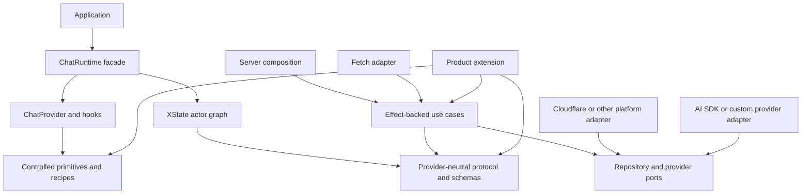
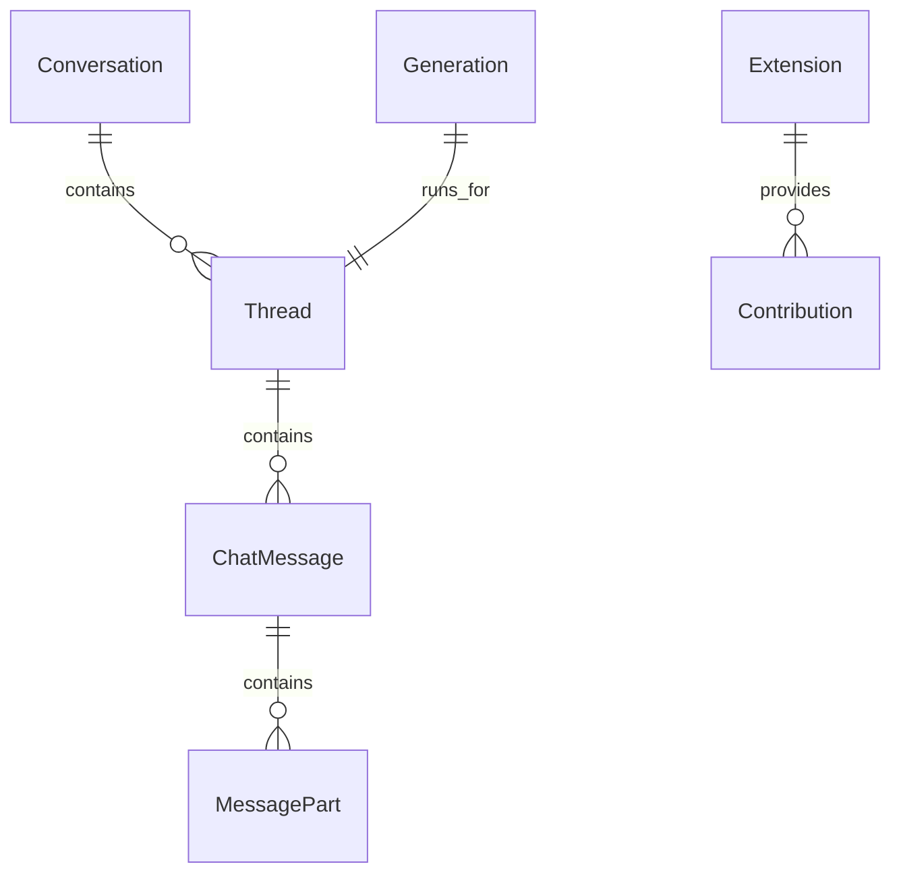

# `@emi/core` API contract

Status: current public contract and architecture reference, verified 2026-08-03.

This document describes what `@emi/core` promises to consumers and extension authors. It is
documentation, not an implementation queue. Active product work belongs in [`plans/`](../plans/);
audit evidence and follow-up are in [`core-audit.md`](./core-audit.md).

## Purpose

`@emi/core` is a reusable chat and agent platform for applications that need a pleasant common
path, explicit advanced capabilities, and a source distribution that can be safely forked.

The common path must not expose product APIs, provider message types, database rows, platform
globals, or the historical source layout. The package may contain multiple layers internally, but
each consumer job has a named subpath and a tested dependency boundary.

## Architecture at a glance



The four supported boundaries are:

1. **Protocol:** provider-neutral types, schemas, IDs, errors, commands, events, and extension
   contracts.
2. **Runtime:** an actor graph presented through selectors, commands, lifecycle, and
   subscriptions.
3. **Presentation:** React integration, controlled primitives, connected components, and
   recipes.
4. **Server:** typed ports and Effect use cases translated to Fetch by an adapter and bound to
   D1, Workers, or another platform by explicit adapters.

XState remains the internal owner of actor state and async lifecycle. Effect remains the server
and composition model for typed services, failures, schemas, resource safety, and layers. Both
are hidden from the common consumer path and available through explicit advanced surfaces.

## Common consumer path

A normal React consumer can build a complete chat without knowing the actor graph, Effect layers,
AI SDK message types, D1, or the core source tree:

```tsx
import { createChatRuntime } from "@emi/core";
import { ChatProvider } from "@emi/core/react";
import { ChatApp } from "@emi/core/components/styled";
import "@emi/core/styles.css";

const runtime = createChatRuntime({
  transport: { baseUrl: "/api", fetch },
  storage: { settings, drafts },
  browser: { online, subscribeOnline },
  identity: { createId, now },
  features: { attachments: true, memories: true, branches: true },
});

root.render(
  <ChatProvider runtime={runtime}>
    <ChatApp />
  </ChatProvider>,
);
```

Consumers can replace the recipe with their own views while retaining the same runtime:

```tsx
const messages = useChatSelector(selectors.activeThread.messages);
const { sendMessage, stop, selectConversation } = useChatActions();

sendMessage({ text, attachments });
selectConversation({ conversationId });
stop();
```

The facade exposes stable concepts such as active conversation and thread, composer state,
conversation and memory lists, settings, and connection status. Commands cover sending, stopping,
retrying, selecting, editing, branching, and settings updates. Streaming is observed through
actor-owned state and subscriptions rather than turned into an imperative promise for every
transition.

## Public package map

The catalog is curated. Internal files may move when the catalog and its contract tests continue
to pass.

| Subpath | Responsibility | Boundary it must not cross |
| --- | --- | --- |
| `@emi/core` | Minimal facade: `createChatRuntime` and core protocol types | Wildcard internals, product APIs, platform dependencies |
| `@emi/core/protocol` | Messages, parts, commands, events, errors, IDs, schemas, extension contracts | React, actor internals, server services, database rows |
| `@emi/core/api` | Generic HTTP contract and `CoreApiClient` | HealthFit routes, raw decoding, database details |
| `@emi/core/chat` | Explicitly provider-bound grouped chat operations | The common provider-neutral path and flat helpers |
| `@emi/core/contract` | Generic HTTP schema composition owned by `CoreApi` | HealthFit groups, platform bindings, database rows |
| `@emi/core/runtime` | Framework-neutral runtime, selectors, commands, subscriptions, lifecycle | React hooks and markup |
| `@emi/core/react` | `ChatProvider`, hooks, and React lifecycle integration | Styled recipes, routing, browser globals |
| `@emi/core/components` | Accessible controlled/headless primitives and slots | Network, persistence, product copy, mandatory CSS framework |
| `@emi/core/components/styled` | Ready-to-use recipes and default visual layer | HealthFit branding and mandatory platform coupling |
| `@emi/core/web` | Generic browser views, contributions, attachment policy, thread presentation | Raw actors, HealthFit UI, platform state |
| `@emi/core/styles.css` | Design tokens, structure, states, and theme variables | App-specific pages and data visualizations |
| `@emi/core/server` | Generic ports, use cases, auth interfaces, persistence-independent composition | D1/Drizzle row types in the primary entry |
| `@emi/core/server/database` | Advanced SQL schemas, persistence domains, and AI SDK generation replay | Generic server contracts, common consumers, and provider-neutral replay |
| `@emi/core/server/effect` | Effect-native services, layers, and use-case access | React-only concerns and provider message types |
| `@emi/core/server/fetch` | `Request`/`Response` handlers over server composition | Platform-specific bindings |
| `@emi/core/adapters/ai-sdk` | AI SDK/provider bridge to the core protocol | AI SDK types in protocol or runtime core |
| `@emi/core/adapters/cloudflare` and `/cloudflare` | D1, Workers, R2, auth, and route composition | Cloudflare assumptions in generic server logic |
| `@emi/core/extensions` | Namespaced extension definitions and collision-checked composition | Product code bundled into base core |
| `@emi/core/testing` | In-memory repositories, deterministic adapters, actor harnesses, fixtures | Production runtime dependencies |
| `@emi/core/advanced/xstate` | Deliberate actor refs, machine types, and integration helpers | Accidental access through default barrels |

HealthFit composes the generic contract through `@emi/flavor-healthfit/contract`. Core does not
know HealthFit, Hevy, fitness, analytics, privacy, or workout vocabulary.

## Protocol and schema boundaries

The protocol owns provider-neutral message concepts:

```ts
type ChatMessage = {
  id: MessageId;
  role: "user" | "assistant" | "system" | "tool";
  parts: ReadonlyArray<MessagePart>;
  createdAt: string;
};

type MessagePart =
  | { type: "text"; text: string }
  | { type: "reasoning"; text: string }
  | { type: "file"; file: Attachment }
  | { type: "tool-call"; call: ToolCall }
  | { type: "tool-result"; result: ToolResult };
```

Provider adapters translate AI SDK, OpenAI-compatible, Anthropic, or custom provider values at
the edge. The protocol must not contain `UIMessage`, `FileUIPart`, `OpenAiClientConfig`, HealthFit
types, or database rows.

The advanced `@emi/core/server/database` generation replay currently stores AI SDK message chunks
as an explicit transport contract. That surface is not part of the provider-neutral protocol or
the common consumer path. A future portable replay requirement would introduce a new versioned
generation-event format and migration; it must not silently reinterpret existing rows.

Every boundary has a named runtime schema and mapper:

```text
protocol domain types  <->  wire API DTOs  <->  repository/domain types  <->  database rows
             ^                   ^                    ^
       provider adapter     HTTP adapter          SQL/platform adapter
```

Persisted JSON, wire payloads, extension parts, and tool results are decoded before entering
domain state. Namespaced extension parts and tool results are schema-validated; `Schema.Unknown`
is not the normal extension mechanism.

## Runtime ownership

`createChatRuntime` owns a disposable actor graph. The runtime must:

- start and stop owned actors exactly once;
- expose selectors instead of child snapshots;
- keep transport, persistence, browser, and UI state in actors rather than React state;
- give replaceable queries an operation identity plus latest-wins or cancellation semantics;
- reserve transport-owned fields from extension request data;
- accept injected fetch, origin, clock, ID, browser, storage, and persistence adapters;
- expose structured errors and generation status without AI SDK types; and
- support extensions without allowing them to mutate core protocol semantics.

The parent stores actor references and coordination state, not duplicated child snapshots. Real
`createActor` tests cover lifecycle, cancellation, ordering, failures, stale work, and disposal.

## Server composition

Effect is the canonical fallible server API. Promise conversion belongs at the named host edge:

```ts
const serverLayer = ChatServerEffect.Live.pipe(
  Layer.provide(authLayer),
  Layer.provide(repositoryLayer),
  Layer.provide(modelLayer),
  Layer.provide(configurationLayer),
);

const response = yield * ChatFetchHandlers.use((handlers) => handlers.handle(request)).pipe(
  Effect.provide(ChatFetchHandlers.layer().pipe(Layer.provide(serverLayer))),
);
```

Server composition separates typed use cases, repository ports, provider/model ports, HTTP
translation, authentication/request context, and platform bindings. Generation admission occurs
before durable user-turn persistence; a losing concurrent request returns a structured conflict
without an orphan message. External values pass through schemas and explicit mappers.

`ChatServerEffect.Live` is the generic reference/starter composition for generated and fixture
consumers. The HealthFit production lifecycle remains composed in
[`apps/api/src/core/routes`](../apps/api/src/core/routes) until the active platform plan moves
that lifecycle into a real generic composition. These are intentionally different scopes, not two
claims of production parity.

Effect `Context.Service` and `Layer` own dependency-bearing contracts. Effect `Stream` is the
default incremental boundary for readable streams and async iterables, preserving cancellation,
resource cleanup, and tagged failures.

## Presentation and extensions

Components have three visible tiers:

1. **Controlled primitives** accept values, callbacks, slots, and semantic data attributes.
2. **Connected components** read runtime context and translate commands into primitive props.
3. **Recipes** compose a complete experience while leaving routing, persistence, confirmation,
   and product configuration to the host.

Core components do not read browser globals, own routing, perform persistence, show product
confirmation dialogs, or call a provider directly. Those concerns belong in connected layers,
host callbacks, or extensions.

Extensions may contribute explicitly named API groups, server handlers/tools, prompt contributors,
schema-validated parts, navigation, pages, and renderers. They own their domain tables and
migrations. Composition validates namespaces and collisions deterministically.

## Distribution

Registry mode publishes built ESM and declarations with curated conditional exports, dependency
tiers, clean packed-consumer tests, and public TypeScript fixtures.

Source mode generates an owned copy of supported source modules, tests, styles, and licenses from
the same catalog. The generated workspace includes provenance and a manifest, keeps copied source
separate from installed dependencies, and reports local edits before an upgrade or regeneration.
Neither mode requires a consumer to understand `packages/core/src` or historical source paths.

## Data ownership



The physical database model belongs to a server/platform adapter. Raw rows never escape into the
protocol or primary server entry. Core and product flavor data remain separate, with explicit
ownership checks at repository boundaries.

## Non-negotiable exclusions

- Product APIs remain in extensions or flavor packages; core is not a product dumping ground.
- Stable and advanced exports remain different contracts; wildcard barrels are not supported.
- XState is not replaced with React state, event emitters, or unowned promises.
- Effect is not replaced with an untyped service locator or hidden synchronous throws.
- Provider-specific message types do not become the protocol by convenience.
- Components do not perform network, persistence, routing, or confirmation side effects without
  an explicit connected layer or host callback.
- Source generation never silently overwrites arbitrary local edits.
- Historical extraction names and compatibility aliases are not part of the target contract.

## Verification status

The implementation covered the original R0–R8 boundaries. Current evidence includes curated
exports, provider-neutral schemas and mappers, actor/runtime and React fixtures, typed Effect
server composition, adapter isolation, extension checks, packed-consumer tests, source-generation
acceptance, and the full repository release gate.

On 2026-08-03, `pnpm release:check` passed with the main chat E2E suite at 92/92 and the generic
web suite at 13/13. New changes should preserve these contract tests and update this document
when the public catalog or boundary decisions change.

## Decisions and future questions

The current decisions are to keep the mixed-layer package, XState, Effect, named domain owners,
Effect-first fallible operations, injected persistence capabilities, explicit advanced subpaths,
HealthFit in a flavor package, and separate registry/source distribution modes.

Future questions should be resolved only when a change needs them: runtime command return values,
automatic provider startup, namespaced custom parts, normalized streaming events, source-fork
upgrade behavior, default style inclusion, and whether production SQL adapters remain explicit or
gain a reference implementation. None permits weakening actor ownership, schema boundaries, or
product isolation.
