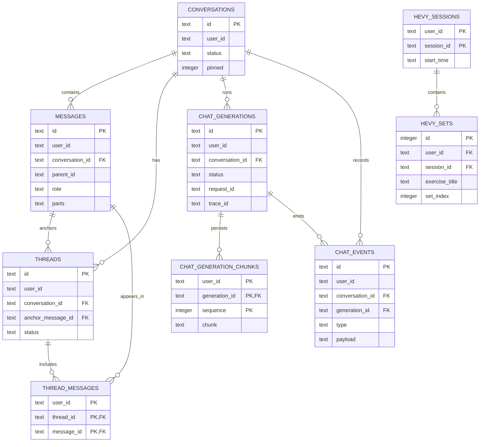

# Database schema

The Drizzle definitions in `apps/api/src/db/schema.ts` are the source of truth. Tables are not renamed here: a physical rename needs a generated Drizzle migration and a data-compatibility decision.

All health, chat, suggestions, memory, notes, and privacy rows are owner-scoped by `user_id`. The ownership column is intentionally shown even where the database has no declared foreign key to the Better Auth tables.

| Area             | Tables                                                                                |
| ---------------- | ------------------------------------------------------------------------------------- |
| Health import    | `daily_activity`, `health_workouts`, `sleep_sessions`, `body_metrics`, `sync_cursors` |
| Strength import  | `hevy_sessions`, `hevy_sets`                                                          |
| Conversation     | `conversations`, `messages`, `threads`, `thread_messages`                             |
| Chat reliability | `chat_generations`, `chat_generation_chunks`, `chat_events`                           |
| User data        | `suggestions`, `memories`, `notes`, `privacy_preferences`                             |
