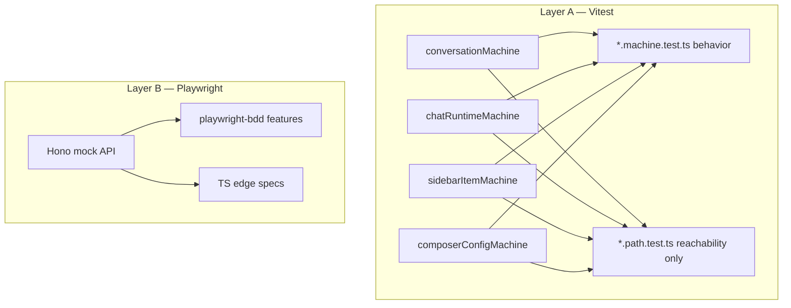

# Chat E2E coverage plan

## Context

- Chat frontend already has four XState machines with strong Vitest unit tests:
  - `conversationMachine`, `chatRuntimeMachine`, `sidebarItemMachine`, `composerConfigMachine`
- Playwright E2E lives in one file: `apps/chat/e2e/chat.spec.ts` (~12 flows). It covers API-key gate, session switch, tool render, new chat, attachment preview, timeout retry, orphan turn, generation resume, notes, memories.
- Large chat UI surface is untested in the browser: suggestions, stop, edit/regenerate, fork/branch, sidebar rename/delete/pin/archive/clone/share/download, composer toggles, in-thread search, view mode.
- Stack: XState 5 (`xstate/graph` built-in), Playwright 1.61, Effect Schema already used in E2E helpers. Playwright config blocks service workers.

## Goal

Every user-visible chat capability has a browser journey, and every production machine transition is covered by model-based Vitest path tests — without exploding into a cross-product of all machines in the browser.

## What

Two-layer coverage:

1. **Layer A (Vitest)** — behavior in existing `*.machine.test.ts`; optional `*.path.test.ts` via `xstate/graph` only as **reachability smoke** (impossible / unreachable states), not a substitute for behavior asserts.
2. **Layer B (Playwright)** — hybrid BDD:
   - Gherkin (`playwright-bdd`) for happy paths
   - TypeScript specs for stream/error edge cases that need heavy mocking

No parallel “journey” XState machine. A second UI model would drift from production machines and the browser; E2E drives the real app.

In-scope wave 1 (no cuts):

1. Suggestions → send + show
2. Stop mid-stream
3. Edit user message / regenerate
4. Fork branch + focus
5. Sidebar: rename, delete, pin, archive, clone
6. Composer: temporary, coach, web, model
7. In-thread search + view mode
8. Share / download / copy markdown

## Why

Unit tests prove machine logic in isolation. Current E2E proves a thin slice of the happy path and a few recovery cases. Regressions in suggestions, branching, sidebar mutations, and composer modes can ship unnoticed. Model-based paths close transition gaps; journey E2E closes UI wiring gaps.

## How

### Conceptual model



### Operations / behavior

| Capability | Layer A | Layer B |
|---|---|---|
| Load / cache / error / retry conversation | conversationMachine paths | existing + extend |
| Submit / revise / resume / stop / fail stream | chatRuntimeMachine paths | stop, edit, regenerate, resume |
| Sidebar rename/delete/pin/archive/clone/copy/share/download | sidebarItemMachine paths | one E2E each |
| Model / coach / web / temporary | composerConfigMachine paths | one E2E each |
| Suggestions click → send | n/a (UI) | BDD happy path |
| Fork branch + focus | conversation `thread.fork` | BDD + TS |
| Search / view mode | conversation actions | BDD |

### Tech choices

| Choice | Decision | Rationale |
|---|---|---|
| “Every” scope | Per-machine reachability + one E2E per capability | Cross-product of 4 machines in browser is unbounded and flaky |
| BDD | Hybrid: Gherkin happy paths, TS for edges | Readable smoke without fighting Gherkin for SSE/orphan mocks |
| Model-based E2E journey machine | **Removed** | Parallel UI machine desyncs from prod/runtime; never drove Playwright |
| Layer A path suites | Keep as reachability smoke only | Behavior stays in `*.machine.test.ts` + Playwright |
| API mock | Small **Hono** mock app, fulfilled via Playwright `page.route` → `app.fetch` | Replaces giant if-chain; no service worker; scenario overrides stay local |
| MSW | No for Playwright | `serviceWorkers: "block"`; Playwright route is the right interception layer |
| Real API / live LLM | Not in wave 1 | Keep CI deterministic |
| `@effect/vitest` | Skip for Layer A | Path/unit tests exercise XState, not Effect programs |

### Architecture

```
apps/chat/
  e2e/
    mock/
      app.ts              # Hono mock API (default fixtures)
      fixtures.ts         # conversations, streams, suggestions helpers
      install.ts          # page.route(**/api/**, → app.fetch)
    features/             # playwright-bdd Gherkin
      suggestions.feature
      composer.feature
    steps/                # shared Given/When/Then
    chat.spec.ts          # recovery / notes / memories (TS)
    chat-scenarios.spec.ts  # wave-1 chat UI (TS)
  app/chat/
    *.machine.test.ts       # behavior
    *.machine.path.test.ts  # reachability smoke only
```

Mock wiring:

```ts
await page.route("**/api/**", async (route) => {
  await fulfillMockApi({ route, app });
});
```

Scenario tests override handlers for one test without copying the whole if-chain.

## What this allows

- Reachability smoke per production machine (`getShortestPaths` / path twins).
- Behavior coverage via existing machine unit tests + Playwright.
- Readable BDD smoke for product language (“Given… When… Then…”).
- Deterministic CI with a maintainable mock API.

## What this does not allow

- Exhaustive cross-product of all four production machines in one browser session.
- A second journey machine that “models” the UI separately from production.
- Live OpenAI calls in default CI.
- Path suites replacing behavior unit tests.
- MSW service-worker interception in Playwright.

## Next wave (not done)

High value leftover E2E / behavior gaps:

1. Temporary chat — no persistence after refresh
2. Web search on when model supports it
3. Compact conversation
4. Send attachment (not only preview)
5. Concurrent submit blocked while streaming (UI)
6. Guest continue → chat
7. Thread discard / restore from branch nav
8. Restore archived session from sidebar
9. Message action bar copy / export
10. Multi-tool / tool-error stream rendering

## UI & UX

N/A — test infrastructure. Selectors prefer accessible roles/labels already used in the app (`Message input`, `New chat`, suggestion buttons, sidebar menus).

## Data model

No production schema changes. Mock fixtures mirror `@emi/api-contract` conversation/message/thread/suggestion shapes.

## Implementation steps

1. Write this plan; lock decisions (done in session).
2. Add deps: `hono`, `playwright-bdd` in `@emi/chat`.
3. Extract `e2e/mock` Hono app; migrate `chat.spec.ts` to `installMockApi`.
4. Add Layer A path suites for each machine (start with `chatRuntimeMachine` + `composerConfigMachine`, then sidebar + conversation with invoke stubs / filtered events).
5. ~~Add `chatJourneyMachine`~~ → **dropped** (desync risk; never drove Playwright).
6. Configure `playwright-bdd`; add wave-1 feature files + steps.
7. Implement remaining wave-1 TS edge cases (stop mid-stream, edit/regenerate with SSE control).
8. Keep existing recovery specs; delete duplicated if-chain only after green.
9. `pnpm --filter @emi/chat test` + `test:e2e:run` focused; before handoff `pnpm release:check`.

## Open questions

1. ~~Mock strategy~~ → Hono + Playwright route (MSW deferred).
2. ~~BDD vs TS~~ → hybrid.
3. French sidebar labels (`Épingler`, `Archiver`) — assert via current UI strings or add stable `data-testid`s? Prefer accessible names as-is for now; add testids only if flakes appear.
4. ~~Path-driven Playwright via journey machine~~ → removed.

## Acceptance criteria

- [x] Each of the four production machines has a `*.path.test.ts` (or equivalent) exercising reachable state coverage via `xstate/graph` (`getShortestPaths` / event sequences; invoke/`after` twins where needed).
- [x] Hono mock replaces the monolithic `fulfillApi` if-chain; existing E2E still pass.
- [x] playwright-bdd configured; suggestions + composer happy paths are Gherkin.
- [x] Wave-1 capabilities 1–8 each have ≥1 passing browser test (view-mode UI absent → Layer A only).
- [x] No MSW in Playwright path; service workers remain blocked.
- [ ] `pnpm release:check` green before session complete.

## Decisions log

| Date | Decision | Rationale |
|---|---|---|
| 2026-07-20 | Scope = Layer A + one E2E per capability | Avoid combinatorial explosion |
| 2026-07-20 | Hybrid BDD | Happy paths readable; edges stay TS |
| 2026-07-20 | Dedicated journey machine for E2E MBT | UI-observable; not compose prod machines |
| 2026-07-20 | **Drop `chatJourneyMachine`** | Twin model desyncs; did not drive Playwright; E2E stays BDD + TS on real app |
| 2026-07-20 | Layer A in Vitest | Machines already unit-tested there |
| 2026-07-20 | Hono mock via `page.route` | Cleaner than if-chain; SW-safe vs MSW |
| 2026-07-20 | Skip `@effect/vitest` for Layer A | No Effect programs under test |
| 2026-07-20 | No wave-1 cuts | Full capability list required |
| 2026-07-20 | View-mode E2E deferred | `view.select` exists on machine only — no chat UI wiring yet; covered in Layer A |
| 2026-07-20 | Use `getShortestPaths` + path twins | `createTestModel` rejects machines with `invoke` / `after`; twins cover state graphs; actor behavior stays in existing unit tests |
| 2026-07-20 | Path suites = reachability only | Do not pretend they assert behavior |
