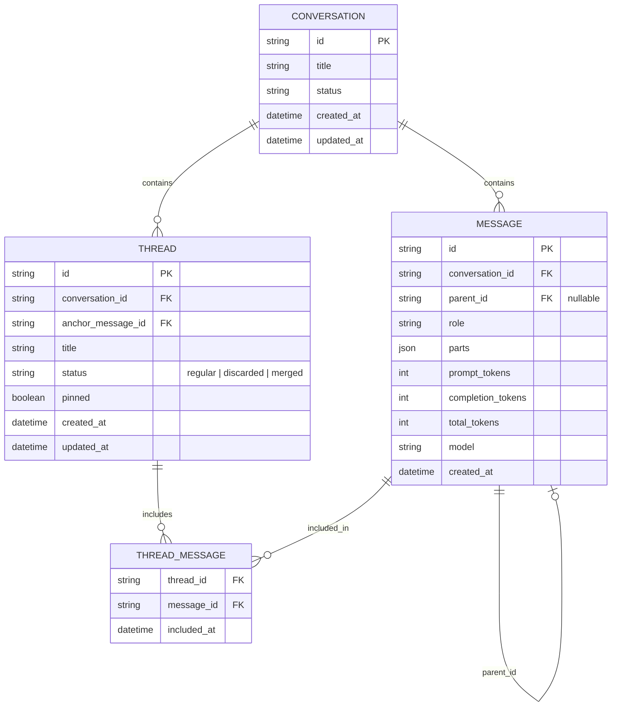

# Chat threading plan

## Naming

The repository already has a `threads` table, but it models a top-level conversation/session. Introducing nested threads creates a naming collision, so we must rename the existing concept or pick a different name for the new one.

### Option A — Conversation + Thread (recommended)

- Rename the existing `threads` table to `conversations`.
- The new nested tree units are called `threads`.
- **Why:** It matches the vocabulary users already use (“threaded conversations”, “go deeper on that point in a thread”). It also decouples the top-level container from the branching unit: one conversation can contain many threads.

### Option B — Thread + Branch

- Keep the existing `threads` table as-is.
- The new nested units are called `branches`.
- **Why:** Preserves backward-compatible URLs and DB naming. The word “branch” signals divergence/merge semantics, which can feel technical and Git-like.

### Option C — Session + Side-thread

- Rename the existing `threads` table to `sessions`.
- The new nested units are called `side-threads`.
- **Why:** Directly evolves the old “side chat” feature into something persistent and hierarchical. However, “session” is overloaded with auth/session terminology.

### Option D — Chat + Thread

- Rename the existing `threads` table to `chats`.
- The new nested units are called `threads`.
- **Why:** Common in consumer apps, but “chat” can also mean the whole product.

### Decision

Use **Option A: Conversation + Thread**.

- A `conversation` is the top-level persistent container (today’s `thread`).
- A `thread` is a lightweight, persistent, hierarchical branch of messages inside a conversation.

## What

A first-class, tree-shaped conversation model where any message can spawn one or more persistent threads. Threads are not ephemeral side chats and they are not “new chat” hard forks. They live inside the same conversation, share history up to their fork point, and can be navigated, referenced, summarized, merged, or discarded.

Key properties:

- Every message has an optional `parent_id`.
- Sibling messages with the same parent are alternate continuations.
- A thread is a relational view anchored at a message (or fork point), not a separate storage bucket.
- Threads are persistent and searchable.
- Messages can reference other messages with `<message id="..." />`.
- The assistant can manage threads through explicit tools or through UI actions initiated by the user.

## Why

User feedback converges on a small set of pain points:

1. **Linear conversations are a bottleneck.** LLMs reason in trees, but chat UIs force a single line. Users want to explore “go deeper on point two” without losing the main conversation.
2. **Forks/side chats are too coarse.** Opening a new chat is a clean break; context is lost or duplicated. Existing side chats are ephemeral and disappear from history.
3. **Context pollution.** Every new tangent pollutes the main model context. Threads give isolated scopes that share only the relevant prefix.
4. **No follow-up to spawned work.** Sub-agents and side chats reset context for each new prompt. Users want continuity inside a branch.
5. **Need for time travel and branching.** Users want to compare alternatives, discard dead ends, and promote promising branches back to the main line.

## How

### Core model

```
Conversation
└─ Message A
   ├─ Message B
   │  └─ Message C   ← main trunk
   └─ Message D      ← fork from A
      ├─ Message E   ← thread 1
      └─ Message F
         └─ Message G
```

- Messages are stored as a flat list.
- `parent_id` builds the tree; ordering siblings by creation time (or explicit position) gives the projection.
- A `thread` is a named, anchored view: `thread.anchor_message_id` points to the fork/root message. All descendants of that anchor belong to the thread unless they are part of a deeper sub-thread.
- Threads are relational: the `thread_messages` table records which messages belong to which thread view. This lets the same message appear in multiple threads and lets threads be compacted independently.

### Operations

| Operation | What it does |
|-----------|--------------|
| **Fork** | Create a new thread starting at any existing message. The new thread inherits all messages from the root conversation up to the fork point. |
| **Reply in thread** | Add a message whose `parent_id` is inside a thread rather than on the main trunk. |
| **Create empty thread** | Start a thread anchored at a message with no new messages yet, used as a scratchpad. |
| **Summarize thread** | Replace a thread’s visible messages with a compact summary message that can be referenced by the parent or main trunk. |
| **Merge (promote)** | Replace the main trunk from the fork point forward with the selected thread’s message chain. The previous trunk becomes an archived branch. |
| **Merge (append summary)** | Append a summary of the thread to the parent line without deleting anything. Non-destructive. |
| **Discard** | Mark a thread as discarded (soft delete). It disappears from the default tree view but remains in history. |
| **Pin** | Keep a thread visible as a quick-access item inside the conversation. |
| **Reference** | Insert `<message id="..." />` in any message to point to another message across threads. |
| **Focus** | Enter a thread so the input box and history show only that thread’s context. |
| **Zoom out** | Return to the parent or conversation root and see the full tree. |

### Merge / discard proposals

| Approach | Behavior | Best for | Risk |
|----------|----------|----------|------|
| **A. Promote snapshot** | The selected thread tip becomes the new main trunk from the fork point. The old trunk is archived as a sibling branch. | Choosing a winning alternative | Destructive to main line; needs undo |
| **B. Append summary** | A generated summary message is appended to the parent line. The thread stays available in full. | Keeping context without noise | Summaries can lose detail |
| **C. Keep parallel** | No merge. The thread remains an alternate timeline forever. | Comparing alternatives | Tree gets wide and hard to scan |
| **D. Discard** | The thread is marked hidden. It can be un-discarded from history. | Dead ends | Users may fear data loss |

**Decision:** merge actions are designed into the data model but **not implemented in the first version**.

- The data model must keep enough information to support promote-snapshot and append-summary merges later (full message tree, thread anchor, thread status, sibling relationships).
- First version ships with **D (discard)** only.
- Merge UI/UX is specced and the schema supports it, but the actual merge endpoints and actions are deferred until there is proven demand.

### LLM tool surface proposals

#### Option 1 — Explicit thread tools (recommended)

The assistant sees a compact set of tools for reasoning about the conversation structure:

- `getThreads(conversationId)` — list threads in the current conversation with metadata.
- `readThread(threadId)` — read the full message chain of a thread.
- `readMessage(messageId)` — read a single referenced message.
- `createThread(anchorMessageId, title?)` — fork a new thread at a message.
- `summarizeThread(threadId)` — produce a summary message and store it.
- `summarizeToMessage(threadId, targetMessageId?)` — summarize a thread into a referenceable message.

Pros: threads are first-class in the model’s reasoning; the assistant can proactively suggest forks and summaries. Cons: consumes tokens and context; model can over-manage threads.

#### Option 2 — UI-only threading

Threading is a UI/UX layer only. The assistant always receives a linearized context and never knows about forks. The user forks, merges, and navigates threads manually.

Pros: simpler model integration; no extra tools. Cons: the assistant cannot help manage complexity; summarization must be triggered by the user.

#### Option 3 — Lazy hybrid

Expose `readThread`, `summarizeThread`, and `summarizeToMessage` as tools, but do not let the model create or merge threads. The user owns structural actions; the assistant can request to read a thread when referenced by `<message id="..." />`.

Pros: balance between power and safety. Cons: still adds tool schema and prompt instructions.

**Decision:** use **Option 1 — Explicit thread tools**.

The assistant can list, read, create, and summarize threads. Structural merges stay user-initiated (or model-suggested but requiring user confirmation).

### Temporary conversations

Temporary mode is kept as a lightweight, in-memory, single-turn or multi-turn exchange with **no threading support**.

- No `conversation_id` is created in the database.
- Messages are not persisted.
- The thread UI is disabled; the input always appends to the flat temporary list.
- This preserves the existing `temporary` flag behavior and gives users a clean, throwaway option without forcing threading everywhere.

### What the model sees

When the user is focused on a thread, the model receives:

1. Compacted messages from the conversation root up to the fork point.
2. The full message chain inside the focused thread.
3. Summaries of sibling threads (if any) instead of their full content.
4. Any explicit `<message id="..." />` references resolved inline.

```
What LLM sees
├─ msgs (compacted)
│  ├─ msg
│  ├─ msg
│  └─ msg
├─ fork summary: " explored 3 protein options; chose chicken "
└─ current thread msgs
   ├─ msg
   ├─ msg
   └─ msg (latest)
```

### Visualization

A dedicated **tree map view** shows the whole conversation as a node graph: messages as nodes, `parent_id` as edges, threads as highlighted subtrees.

Tools to evaluate:

- **React Flow** — most flexible, React-native, good for interactivity.
- **Stately Editor** / **XState VS Code** paradigms — useful if we later want state-machine semantics, but heavier.
- **Custom SVG/Canvas** — full control, more work.

Usefulness beyond the “wow” effect:

- Orientation: users can see where they are in a deep tree.
- Discovery: find forgotten branches quickly.
- Navigation: click a node to focus that thread/message.
- Presentation: good for sharing or reviewing agent reasoning traces.

Risks:

- Busy graphs become unreadable fast.
- Mobile is cramped.
- Extra dependency and maintenance.

**Decision:** build a React Flow-based tree map as an optional **zoom-out/map view**, not the primary input surface. Primary UI remains inline/tree/column views. Hide or simplify the map on mobile.

### Search

Search is scoped to the current conversation and covers:

- All message text, including inside threads.
- Thread titles.
- Auto-generated summaries.

Search results show:

- Matching snippet.
- Message author and time.
- Thread breadcrumb (e.g., `Main > Upper focus > Abs`).
- Click to jump to the message in its thread context.

Implementation can start client-side for small conversations and move server-side once conversations grow large.

## What this allows

- Fork any message into a persistent thread without losing the original conversation.
- Ask follow-up questions inside a spawned context without resetting the model.
- Explore multiple alternatives in parallel and compare them.
- Keep the main trunk clean while going deep on tangents.
- Reference earlier messages precisely with `<message id="..." />`.
- Summarize long side explorations into compact, referenceable messages.
- Promote a promising branch to become the new line when merge is implemented.
- Search and revisit old threads hours or days later.
- Build agent harnesses where sub-tasks run in isolated threads that report back.
- Search the entire conversation from any view and jump to a message in its thread context.

## What this does not allow

- Cross-conversation threads. Threads are scoped to a single conversation.
- Full Git-style three-way merges with conflict resolution. Merge means “replace with” or “append summary”, not patch-based reconciliation.
- Real-time collaborative editing by multiple human users.
- Arbitrary reordering of messages in time (siblings are ordered by creation/position, but causality is preserved).
- Ephemeral threads. Every thread is persisted by default; discard only hides it.
- Threading in temporary conversations. Temporary mode stays a flat, in-memory, unsaved exchange with no threading UI or API.

## UI & UX

### Desktop proposal A — Inline accordion threads

Threads appear as collapsible cards attached to their fork message. The main trunk stays the primary scroll surface.

```
┌──────────────────────────────────────┐
│  You: Plan my workout for today      │
│  04:17 PM                            │
└──────────────────────────────────────┘
   ┌─────────────────────────────────┐
   │  ▼ Thread: "Upper focus" (4 msgs)
   │  Assistant: Chest + back...     │
   │  You: Add abs                   │
   └─────────────────────────────────┘
   ┌─────────────────────────────────┐
   │  ▶ Thread: "Lower focus" (2 msgs)
   └─────────────────────────────────┘
┌──────────────────────────────────────┐
│  Assistant: Here is the main plan... │
│  04:18 PM                            │
└──────────────────────────────────────┘
```

Pros: context-preserving; easy to scan. Cons: deeply nested threads can push the main line far apart.

### Desktop proposal B — Tree sidebar + main pane

A left sidebar shows the conversation tree. Clicking a thread focuses it in the main pane.

```
┌──────────┬───────────────────────────────┐
│ Workout  │  You: Plan my workout         │
│ ├─ Upper │  Assistant: Chest + back...   │
│ │  └─ Abs│  You: Add abs                 │
│ └─ Lower │  Assistant: Added 3 ab sets   │
│          │                               │
│ [Reply in Thread: Upper]                │
└──────────┴───────────────────────────────┘
```

Pros: scales to deep trees; clear navigation. Cons: tree sidebar consumes space; less immediate than inline.

### Desktop proposal C — Mona-style columns

Each tree level becomes a column. Selecting a message loads its children in the next column, like Finder column view.

```
┌─────────┬─────────────┬─────────────┐
│ Root    │ Fork point  │ Thread      │
│         │             │             │
│ Workout │ Upper focus │ Add abs     │
│         │ Lower focus │             │
└─────────┴─────────────┴─────────────┘
```

Pros: excellent for comparing siblings. Cons: needs horizontal space; awkward on small screens.

### Mobile proposal A — Drill-down stack

Tapping a thread opens it full-screen. A sticky header shows the fork message and a back button returns to the parent.

```
┌─────────────────────────┐
│ ← Upper focus           │
├─────────────────────────┤
│ forked from main plan   │
│                         │
│ Assistant: Chest...     │
│ You: Add abs            │
│                         │
│ [Reply...           ]   │
└─────────────────────────┘
```

Pros: simple mental model; native-feeling. Cons: moving between threads requires multiple taps.

### Mobile proposal B — Swipe columns

One column per tree level. Swipe left to enter a thread, swipe right to go back, like the X mobile client.

```
[Root]  ←swipe→  [Fork point]  ←swipe→  [Thread]
```

Pros: fast navigation; same paradigm as desktop Mona view. Cons: users may lose orientation; hard to show deep context.

### Mobile proposal C — Bottom sheet thread picker

The main chat stays linear. Long-press or tap a message to open a bottom sheet listing its threads, then pick one to focus.

```
┌─────────────────────────┐
│ Main chat               │
│                         │
│ ▓▓▓▓▓▓▓▓▓▓▓▓▓▓▓▓▓▓▓▓▓▓▓ │
│ ┌─────────────────────┐ │
│ │ Threads on this msg │ │
│ │ • Upper focus       │ │
│ │ • Lower focus       │ │
│ │ + New thread        │ │
│ └─────────────────────┘ │
└─────────────────────────┘
```

Pros: keeps main chat readable; quick access. Cons: less visual hierarchy than tree views.

### Recommendation

**Decision:** implement all three desktop views and all three mobile views, and let the user switch the current view from a preference menu.

- **Desktop views:**
  1. Inline accordion (default).
  2. Tree sidebar + main pane.
  3. Mona-style columns.
- **Mobile views:**
  1. Drill-down stack (default).
  2. Swipe columns.
  3. Bottom sheet thread picker.

The preference is persisted per-device (e.g., `localStorage`). Defaults are chosen to minimize cognitive load: inline accordion on desktop, drill-down stack on mobile. The React Flow tree map is available on both as a separate "map" button, not part of the three view switch.

### Common interactions

| User action | Result |
|-------------|--------|
| Hover / long-press a message | Show fork actions: "Reply in thread", "Fork here", "Summarize thread". |
| Click a thread card | Focus that thread; input now replies inside it. |
| Breadcrumb | Shows `Conversation > Main > Upper focus > Abs`. Tap any segment to zoom out. |
| Thread menu | Summarize, merge (append or promote), discard, pin, rename. |
| References | Messages containing `<message id="..." />` render as clickable quote chips. |
| New message in main trunk | If currently inside a thread, offer "Reply in thread" vs "Reply in main". |

## Data model



### Notes on the data model

- `MESSAGE.parent_id` is nullable. Root messages have no parent.
- `THREAD.anchor_message_id` is the fork/root point. The thread view includes the anchor message plus all reachable descendants that are not claimed by a deeper sub-thread.
- `THREAD_MESSAGE` is optional but recommended: it lets the same message belong to multiple thread views and lets threads be summarized/compactable independently.
- `MESSAGE.parts` stays as the existing JSON payload (text, image, file, tool-call, tool-result).
- Existing `threads` and `messages` tables are migrated: `threads` → `conversations`, add `parent_id` to `messages`, create `threads` (new) and `thread_messages`.

## Locked-in decisions

| Topic | Decision |
|-------|----------|
| Naming | Existing `threads` → `conversations`; nested units are `threads`. |
| Nesting | Unlimited nesting in the model; UI caps practical depth and offers zoom/focus. |
| Persistence | All threads are persistent. No ephemeral threads. |
| Temporary conversations | Flat, in-memory, no DB save, no threading UI or API. |
| Merge semantics | Designed but not implemented. Schema must support future promote-snapshot and append-summary merges. |
| LLM tools | Explicit thread tools: `getThreads`, `readThread`, `readMessage`, `createThread`, `summarizeThread`, `summarizeToMessage`. |
| Discarded threads | Hidden from default LLM context; optionally show a one-line “explored and discarded” note. |
| Message references | Custom renderer turns `<message id="..." />` into clickable quote chips. |
| Pinned threads | Per-conversation. |
| Thread titles | Auto-generated from first user message, editable. |
| Desktop UI | Implement inline accordion, tree sidebar, and Mona-style columns; user-switchable. |
| Mobile UI | Implement drill-down stack, swipe columns, and bottom sheet picker; user-switchable. |
| Tree map | Optional React Flow map view, not the primary surface. |
| Search | Search whole conversation including threads; results include breadcrumb and jump-to-context. |

## Open questions

1. Should the model be allowed to discard a thread, or only the user? Start with user-only; model can suggest.
2. Should summarization be automatic after N messages, always user-triggered, or model-triggered with approval? Start user-triggered; evaluate auto later.
3. Should the React Flow map view be editable (drag to reorder) or read-only? Start read-only.
4. How do we prevent the assistant from creating too many threads? Rate limit or require approval after a threshold.
5. Should thread search be client-side-only initially, or backed by a SQLite FTS index? Start client-side; add server-side when needed.
6. Should a thread summary be stored as a new message, a separate `summaries` table, or metadata on the thread? Store as a special `summary` message role in the message tree so it can be referenced naturally.
7. What happens to URLs when a conversation is renamed from `threads` to `conversations`? Migrate routes from `/chat?id=...` to `/conversation/:id` or keep legacy redirect.

## Acceptance criteria

- Any message can be forked into a persistent thread.
- Threads are visible in the conversation history and searchable across the whole conversation.
- Users can reply inside a thread without losing the parent context.
- Users can summarize a thread into a referenceable summary message.
- Users can discard a thread (soft delete) and later restore it.
- Desktop supports inline accordion, tree sidebar, and Mona-style column views; user can switch.
- Mobile supports drill-down stack, swipe columns, and bottom sheet picker views; user can switch.
- A React Flow tree map view is available as an optional zoom-out mode.
- The model can list, read, create, and summarize threads via explicit tools.
- Temporary conversations remain flat, in-memory, and unsaved.
- Existing conversation history remains intact after the migration from `threads` to `conversations`.
