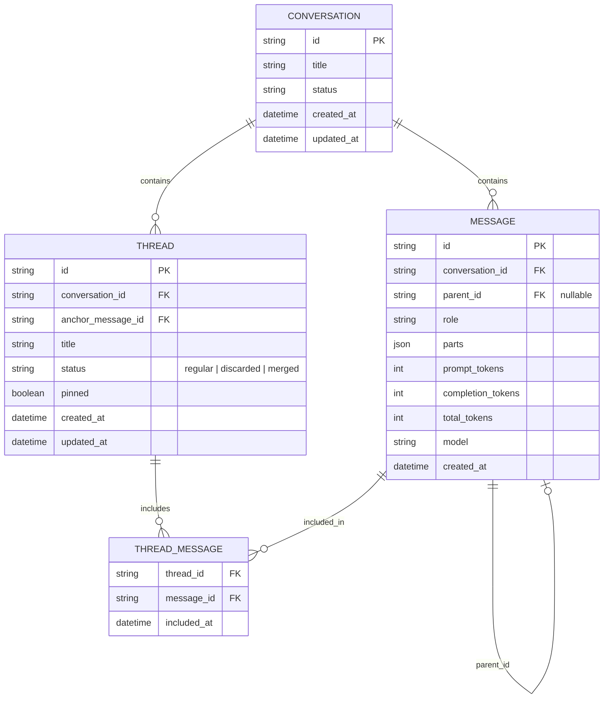

# Chat threading implementation plan

## Context

The chat currently stores sessions in a `threads` table with flat `messages`. We are renaming the top-level container to `conversation` and adding nested, persistent `threads` as a tree of messages.

## Goal

Ship first-class threading inside conversations: fork any message, reply in a thread, summarize, discard, search across the whole conversation, and switch between multiple desktop/mobile views.

## What

- Conversations are top-level persistent containers.
- Messages form a tree via `parent_id`.
- Threads are named views anchored at a message, persisted, and searchable.
- Temporary conversations stay flat and in-memory.
- Merge actions are prepared in the schema but not implemented yet.

## Decisions

| Topic | Decision |
|-------|----------|
| Naming | `threads` table → `conversations`; nested units are `threads`. |
| Nesting | Unlimited in data model; UI caps practical depth. |
| Persistence | All threads persistent; no ephemeral threads. |
| Temporary mode | Flat, in-memory, no DB, no threading. |
| Merge | Schema-ready only; no UI/API in first version. |
| LLM tools | `getThreads`, `readThread`, `readMessage`, `createThread`, `summarizeThread`, `summarizeToMessage`. |
| Discarded threads | Hidden by default; optional one-line note. |
| References | `<message id="..." />` rendered as clickable quote chips. |
| Pins | Per-conversation. |
| Titles | Auto-generated, editable. |
| Desktop UI | Inline accordion (default), tree sidebar, Mona columns — switchable. |
| Mobile UI | Drill-down stack (default), swipe columns, bottom sheet — switchable. |
| Tree map | Optional React Flow zoom-out view. |
| Search | Whole-conversation, client-side first. |

## Data model

### Notes

- `MESSAGE.parent_id` builds the tree.
- `THREAD.anchor_message_id` is the fork/root point.
- `THREAD_MESSAGE` lets the same message appear in multiple thread views and supports compaction.
- Summaries are stored as messages with `role: "summary"` in the tree.

## API

### Database operations

- Rename `threads` → `conversations`.
- Add `parent_id` to `messages`.
- Add new `threads` and `thread_messages` tables.
- CRUD helpers for conversations, messages, threads, thread_messages.

### Endpoints

| Method | Path | Purpose |
|--------|------|---------|
| GET | `/api/conversations` | List/search conversations. |
| POST | `/api/conversations` | Create a conversation. |
| GET | `/api/conversations/:id/messages` | Load message tree for a conversation. |
| PATCH | `/api/conversations/:id/title` | Rename conversation. |
| DELETE | `/api/conversations/:id` | Delete conversation and all data. |
| POST | `/api/conversations/:id/threads` | Fork a new thread. |
| GET | `/api/conversations/:id/threads` | List threads. |
| GET | `/api/threads/:id` | Read thread messages. |
| PATCH | `/api/threads/:id` | Rename/pin/discard. |
| POST | `/api/threads/:id/summarize` | Generate and store summary. |
| GET | `/api/messages/:id` | Read single message. |

### LLM tools

| Tool | Input | Output |
|------|-------|--------|
| `getThreads` | `conversationId` | list of threads |
| `readThread` | `threadId` | full thread chain |
| `readMessage` | `messageId` | single message |
| `createThread` | `anchorMessageId`, `title?` | new thread id |
| `summarizeThread` | `threadId` | summary text |
| `summarizeToMessage` | `threadId`, `targetMessageId?` | summary message id |

## UI & UX

### Shared components

- `MessageActions`: fork, reply-in-thread, summarize, discard.
- `ThreadCard`: collapsible thread preview.
- `ThreadBreadcrumb`: path from conversation root to focused thread.
- `ThreadShelf`: pinned threads quick access.
- `MessageReference`: renders `<message id="..." />` as a quote chip.
- `ViewSwitcher`: select current layout.
- `ConversationSearch`: search input + result list with breadcrumb.
- `TreeMap`: React Flow overview of the whole tree.

### Desktop views

1. **Inline accordion** — thread cards inserted under fork messages in the main scroll.
2. **Tree sidebar** — left tree panel, main pane shows focused thread.
3. **Mona columns** — one column per tree level, swipe/click to drill.

### Mobile views

1. **Drill-down stack** — tap thread to open full-screen, back to parent.
2. **Swipe columns** — one column per level, swipe left/right.
3. **Bottom sheet picker** — long-press message, sheet lists threads.

### Tree map

- React Flow canvas accessible from a "Map" button.
- Read-only; click node to focus.
- Simplified or hidden on small screens.

### Temporary conversation

- Detect `temporary: true` in chat request.
- Hide thread actions and thread shelf.
- Input always appends flatly; no DB writes.

## Implementation steps

### Phase 1 — Schema migration

1. Rename `threads` table to `conversations`.
2. Update foreign keys in `messages` from `thread_id` to `conversation_id`.
3. Add `parent_id` to `messages`.
4. Create new `threads` table.
5. Create `thread_messages` table.
6. Update DB operations and API worker routes.
7. Update frontend data fetching to use `/api/conversations/*`.

### Phase 2 — Core threading backend

1. Add message tree helpers: get roots, get children, build path.
2. Add thread CRUD operations.
3. Add `createThread` fork logic.
4. Update chat handler to load tree context for the focused thread.
5. Store new messages with correct `parent_id`.
6. Add `readMessage` endpoint.

### Phase 3 — LLM tools

1. Register thread tools in `tools/api.ts`.
2. Implement tool handlers in DB operations.
3. Update system prompt to describe threading tools and reference syntax.
4. Resolve `<message id="..." />` references before sending to model.

### Phase 4 — Thread UI

1. Build `MessageActions` and `ThreadCard`.
2. Add thread creation flow.
3. Add thread focus/breadcrumb navigation.
4. Add thread shelf for pinned threads.
5. Add summarize/discard actions.

### Phase 5 — View switcher

1. Implement inline accordion view.
2. Implement tree sidebar view.
3. Implement Mona column view.
4. Add view preference persistence.
5. Repeat the three views for mobile breakpoints.

### Phase 6 — Map and search

1. Integrate React Flow tree map.
2. Build whole-conversation search (client-side first).
3. Add search result jump-to-context.

### Phase 7 — Temporary mode

1. Ensure temporary requests skip all thread logic.
2. Hide thread UI when `temporary` is active.

### Phase 8 — Polish

1. Migration tests for existing data.
2. Unit tests for tree helpers and thread tools.
3. Visual smoke tests for each view.
4. Run `pnpm typecheck`, `pnpm test`.

## Acceptance criteria

- Any message can be forked into a persistent thread.
- Threads are visible, searchable, and replyable.
- Summarize and discard actions work.
- Desktop supports all three switchable views.
- Mobile supports all three switchable views.
- React Flow tree map is available as an optional view.
- Model has explicit thread tools and can resolve message references.
- Temporary conversations stay flat and unsaved.
- Existing history survives the migration.
