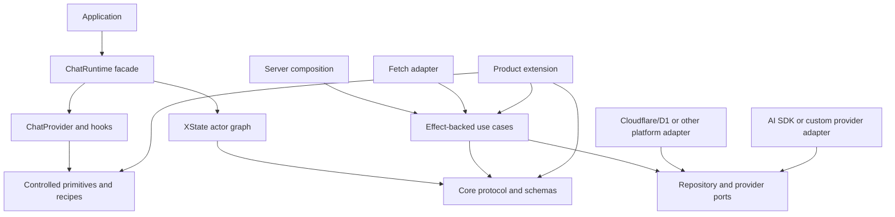
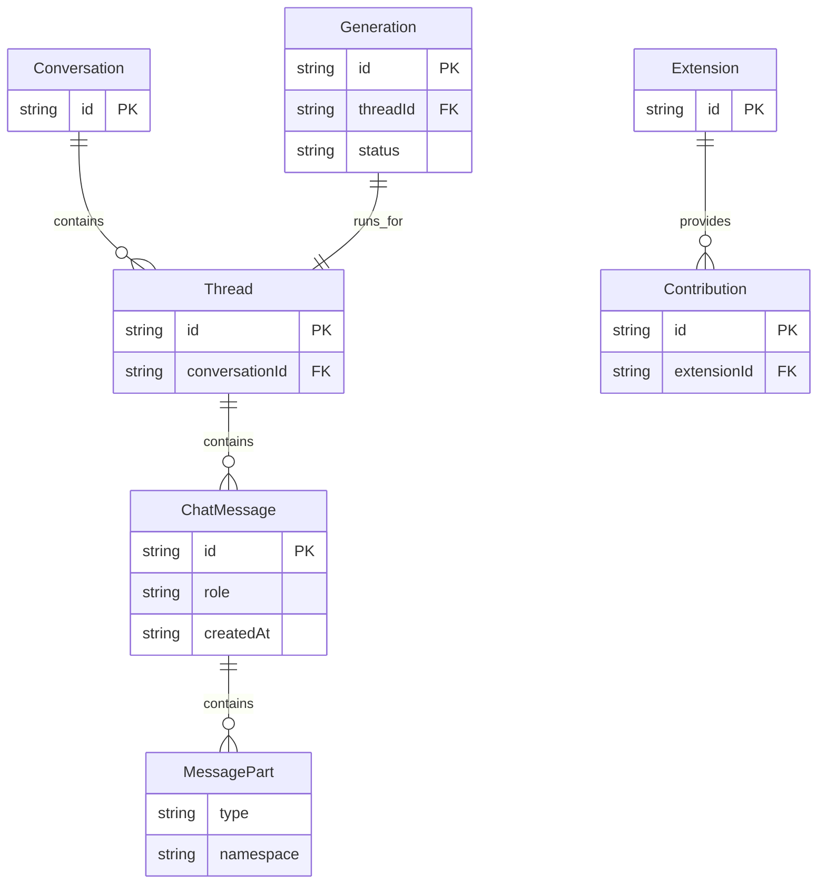
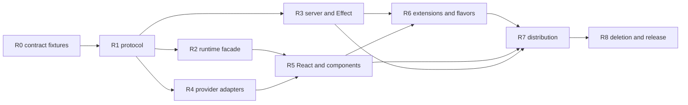

# @emi/core API rewrite plan

## Context

`@emi/core` is intentionally a mixed-layer go-to library for building chat and agent
applications. Actors, web components, styles, server logic, contracts, and platform adapters are
allowed to live together when each capability has an explicit subpath and dependency boundary.
The goal is not to split the package merely to make its directory tree look pure.

The current package was extracted from the existing Emi HealthFit application. It has a useful
architectural spine, but some public concepts still expose extraction history: generic consumers
assemble actor children themselves, runtime and components use AI SDK message types directly,
server routes combine too many responsibilities, and package/source distribution is not yet a
first-class contract. The current defects and evidence are recorded in
[`plans/core-audit-report.md`](./core-audit-report.md).

This document is the normative clean-slate target and execution plan. It assumes no backward
compatibility obligation. It combines the audit's concrete fixes with the design lessons from
starting over, so an implementation agent can work from a packet without reconstructing the
entire discussion.

The implementation engines remain deliberate choices:

- XState remains the internal model for actor ownership, lifecycle, legal transitions,
  cancellation, concurrency, and independently replaceable async work.
- Effect remains the server/use-case and dependency-composition model where it provides typed
  services, schemas, errors, resource safety, and testable layers.
- A normal application does not need to know those engines. The public facade turns them into a
  small runtime, selector, command, component, and fetch-handler API.
- Advanced consumers can opt into explicit XState- and Effect-native subpaths instead of relying
  on accidental exports or reaching through implementation objects.

## Goal

Make `@emi/core` a high-standard generic chat/agent platform that is pleasant to consume in a
new application, powerful to extend, safe to fork in source mode, and independently reusable in
registry mode without exposing product, provider, database, or framework internals by default.

The common path should be short and obvious; the advanced path should be explicit and honest.
The package may still use strong internal engines and contain multiple layers, but consumers
should select a capability by contract rather than by knowing the repository's historical file
layout.

## What

The rewrite defines one curated package with capability subpaths, a provider-neutral protocol, an
actor-backed runtime facade, an Effect-backed server composition, three component tiers, an
extension model, and two supported distribution modes:

1. **Registry mode:** built JavaScript, declarations, curated exports, and isolated dependency
   tiers installed as a normal package.
2. **Source mode:** a generated, owned copy of supported source modules, tests, styles, and
   licenses with a manifest and upgrade/diff procedure, in the spirit of shadcn distribution.

The rewrite is not an immediate implementation. It is the source of truth for the next focused
JJ revisions. Packet IDs below are intended to be assigned to separate agents or separate turns.

## Why

The current package can already implement a chat app, but a new consumer pays too much in
integration knowledge:

- it must understand the actor graph and child refs instead of asking a runtime for user-facing
  state and commands;
- protocol and UI layers know AI SDK message internals, making provider changes expensive;
- server routing, persistence, generation admission, and provider behavior are too closely
  coupled;
- broad barrels make stable exports and advanced implementation hooks indistinguishable;
- the source-copy and registry stories are not generated from one public catalog; and
- product extensions can be mistaken for generic foundations unless ownership is mechanically
  enforced.

These are maintainability and adoption problems, not an argument against XState, Effect, or the
intentional mixed-layer package.

## How

### Conceptual model

The package has four boundaries:

1. **Protocol:** provider-neutral domain types, schemas, IDs, errors, commands, events, and
   extension contracts.
2. **Runtime:** an actor graph that owns state and effects, presented through a framework-neutral
   facade of selectors, commands, lifecycle, and subscriptions.
3. **Presentation:** React integration plus controlled primitives, connected components, and
   ready-made recipes.
4. **Server:** ports and use cases composed with Effect, translated to Fetch/Response by an
   adapter and bound to D1/Workers or another platform by separate adapters.



XState and Effect are not incidental implementation details to be replaced by ad hoc hooks or
plain promises. They are behind the common facade because the consumer's job is to build the
application, not to manually wire the state machine or interpret an Effect layer.

### Operations / behavior

#### Client runtime

`createChatRuntime` owns the actor graph and returns a disposable runtime. The runtime must:

- start and stop all owned actors exactly once;
- expose stable user-facing selectors rather than actor-child snapshots;
- expose commands such as sending, stopping, retrying, selecting, editing, branching, and
  updating settings;
- preserve actor ownership: the parent does not copy child snapshots into parallel state;
- give independently replaceable queries request identity and latest-wins or cancellation
  semantics;
- keep persistence, browser state, transport, and UI state in actors rather than React state;
- accept injected fetch, origin, clock, ID, browser, storage, and persistence adapters;
- expose structured errors and generation status without requiring AI SDK types; and
- support extensions without allowing a product extension to mutate core protocol semantics.

The facade may return promises for operations that have an immediate command result, but it must
not turn every streaming transition into an imperative promise API. Streaming remains a
subscription/state concern owned by the actors.

#### Server

The server composition must separate:

- pure or Effect-backed use cases with typed inputs, outputs, and failures;
- repository ports for conversations, messages, threads, memories, and generations;
- model/provider ports and provider adapters;
- HTTP request/response translation;
- authentication and request context; and
- platform bindings such as D1, R2, Worker environment, or another database.

Generation admission must happen before durable user-turn persistence. A losing concurrent
request must receive a structured conflict and must not leave an orphan user message. Every
persisted external payload must pass through a runtime schema and an explicit mapper.

#### Presentation

Components must be either controlled or connected:

- controlled primitives accept values, callbacks, slots, and semantic data attributes;
- connected components read the runtime context and translate commands into primitive props; and
- recipes compose a complete experience without hiding routing, persistence, confirmation, or
  product configuration inside the component.

The default visual layer should provide accessible structure, keyboard behavior, states, CSS
variables, and structural styles. A consumer may use the recipes, connected pieces with another
design system, or primitives with no core styling dependency.

### Tech choices

| Choice | Decision | Rationale |
|--------|----------|-----------|
| State and async ownership | Keep XState actors internally | Actor lifetimes, transitions, cancellation, queues, and real-actor tests are a strong fit for chat and agent flows. Hide wiring behind a facade rather than weakening the model. |
| Server composition | Keep Effect internally and expose an explicit Effect-native surface | Services, typed failures, schema decoding, resource safety, and layers are valuable. Fetch consumers can use an adapter without learning `Effect.gen` or layers. |
| Public API organization | Group operations under domain classes or owned instances | One domain owner makes discovery, scoping, lifecycle, and dependency ownership visible. Avoid flat files with long lists of exported functions or mutable values; React provider/hooks are a deliberate composition exception. |
| Effect-first fallible operations | Define Effect programs first and derive Promise boundaries | Preserve typed success, failure, and requirements through protocol, server, adapter, and use-case composition. Promise wrappers belong at outer boundaries; synchronous catch-and-throw helpers do not replace the failure channel. |
| Domain protocol | Define core-owned types and runtime schemas | The protocol must not leak `UIMessage`, `FileUIPart`, OpenAI types, HealthFit types, or database rows. |
| Provider integration | Optional `adapters/ai-sdk` and provider-neutral ports | Provider changes stay at an adapter boundary and AI SDK remains optional for consumers who do not use it. |
| React integration | External-store style subscription over the runtime | React renders actor-derived snapshots; it must not own app, network, persistence, or domain state. |
| Components | Controlled primitives plus connected components plus recipes | This makes ownership and customization visible and supports both default apps and design-system adopters. |
| Styling | CSS variables and structural CSS as the baseline; editable styled recipes as an opt-in | A consumer can start quickly or own the markup/styles in source mode without mandatory Tailwind coupling. |
| Schemas | One named runtime-schema source per protocol boundary | Encoding/decoding tests should prove wire DTOs, persisted payloads, and extension parts rather than relying on casts or `Schema.Unknown`. |
| Package output | Built ESM plus declarations with curated conditional exports | Registry consumers should not need the workspace TypeScript toolchain or every platform dependency. |
| Fork distribution | Generated source manifest with ownership metadata | Source mode should be reproducible, diffable, and upgradeable instead of being an undocumented directory copy. |

### Target public package map

Keep one `@emi/core` package, but make each subpath describe a consumer job. The exact names may
be refined during packet R0; the dependency and ownership boundaries are non-negotiable.

| Subpath | Public responsibility | Explicitly excluded |
| --- | --- | --- |
| `@emi/core` | Minimal convenience facade: `createChatRuntime` and core protocol types. | Wildcard internals, product APIs, platform dependencies. |
| `@emi/core/protocol` | Messages, parts, commands, events, errors, IDs, schemas, and extension contracts. | React, XState, Effect runtime services, database rows. |
| `@emi/core/api` | Generic HTTP contract and typed `CoreApiClient` with an Effect-first operation surface. | HealthFit routes, raw response decoding, database details. |
| `@emi/core/runtime` | Framework-neutral runtime, selectors, commands, subscriptions, and lifecycle. | React hooks and UI markup. |
| `@emi/core/react` | `ChatProvider`, hooks, and React lifecycle integration. | Styled recipes, router assumptions, module-scope browser globals. |
| `@emi/core/components` | Accessible controlled/headless primitives, shells, slots, and render contracts. | Network calls, persistence, product copy, mandatory CSS framework. |
| `@emi/core/components/styled` | Ready-to-use recipes and the default visual layer. | HealthFit branding and mandatory platform coupling. |
| `@emi/core/styles.css` | Design tokens, layout structure, states, and theme variables. | App-specific colors, pages, data visualizations. |
| `@emi/core/server` | Generic ports, use cases, auth interfaces, and persistence-independent composition. | D1/Drizzle row types in the primary entry. |
| `@emi/core/server/effect` | Explicit Effect-native services, layers, and use-case access. | React-only concerns and provider-specific message types. |
| `@emi/core/server/fetch` | Request/Response handlers over the server composition. | Platform-specific bindings. |
| `@emi/core/adapters/ai-sdk` | AI SDK/provider bridge to the core protocol and model ports. | AI SDK types in protocol or runtime core. |
| `@emi/core/adapters/cloudflare` | D1, Workers, R2, and platform bindings. | Cloudflare assumptions in generic server logic. |
| `@emi/core/extensions` | `ChatExtensions` definition and collision-checked composition methods. | Product code bundled into the base core. |
| `@emi/core/testing` | In-memory repositories, deterministic clock/ID/fetch/storage adapters, actor harnesses, and fixtures. | Production runtime dependencies. |
| `@emi/core/advanced/xstate` | Deliberate actor refs, machine types, and integration helpers for advanced consumers. | Accidental access through default barrels. |

The stable public catalog must be hand-curated. Internal files can be reorganized freely when the
catalog and its tests continue to pass.

### Common consumer API

The default React app should be approximately this small:

```tsx
import { createChatRuntime } from "@emi/core";
import { ChatProvider } from "@emi/core/react";
import { ChatApp } from "@emi/core/components/styled";
import "@emi/core/styles.css";

const runtime = createChatRuntime({
  transport: { baseUrl: "/api", fetch },
  storage: { settings, drafts },
  browser: { online, subscribeOnline },
  identity: { createId, now },
  features: { attachments: true, memories: true, branches: true },
});

root.render(
  <ChatProvider runtime={runtime}>
    <ChatApp />
  </ChatProvider>,
);
```

The component may be replaced with custom pieces without changing the runtime:

```tsx
const messages = useChatSelector(selectors.activeThread.messages);
const { sendMessage, stop, selectConversation } = useChatActions();

sendMessage({ text, attachments });
selectConversation({ conversationId });
stop();
```

The facade should expose stable user-facing concepts such as:

```ts
interface ChatSelectors {
  activeConversation: Selector<Conversation | undefined>;
  activeThread: Selector<ThreadViewState>;
  composer: Selector<ComposerState>;
  conversations: Selector<ConversationListState>;
  memories: Selector<MemoryListState>;
  settings: Selector<ChatSettingsState>;
  connection: Selector<ConnectionState>;
}

interface ChatActions {
  sendMessage(input: SendMessageInput): void;
  stop(): void;
  retry(input: RetryMessageInput): void;
  selectConversation(input: SelectConversationInput): void;
  selectThread(input: SelectThreadInput): void;
  updateConversation(input: UpdateConversationInput): void;
  updateSettings(input: UpdateSettingsInput): void;
}
```

This does not prohibit an advanced API such as `runtime.actorRef` or Effect-native services. It
does prohibit making raw child snapshots and transport event envelopes the only usable API.

### Protocol before framework

The core protocol owns a small provider-neutral message model:

```ts
type ChatMessage = {
  id: MessageId;
  role: "user" | "assistant" | "system" | "tool";
  parts: ReadonlyArray<MessagePart>;
  createdAt: string;
};

type MessagePart =
  | { type: "text"; text: string }
  | { type: "reasoning"; text: string }
  | { type: "file"; file: Attachment }
  | { type: "tool-call"; call: ToolCall }
  | { type: "tool-result"; result: ToolResult };
```

AI SDK, OpenAI-compatible, Anthropic, and custom providers translate at the adapter boundary.
The protocol must not contain `UIMessage`, `FileUIPart`, `OpenAiClientConfig`, or a HealthFit
vocabulary. Provider-neutral `ModelConfiguration`, `GenerationEvent`, `TransportError`, and
`Attachment` types replace those extraction artifacts.

The DTO flow is explicit:

```text
protocol domain types  <->  wire API DTOs  <->  repository/domain types  <->  database rows
             ^                   ^                    ^
       provider adapter     HTTP adapter          SQL/platform adapter
```

Each arrow owns a named mapper and contract tests. Extension message parts and tool results are
namespaced and runtime-schema validated. `Schema.Unknown` is not the normal extension mechanism.

### Runtime and actor boundary

The internal graph may retain separate actors for session, transport, conversation store,
browser state, persistence, and UI coordination. It should continue to obey these rules:

- each actor owns its own state and side effects;
- the parent stores actor refs and coordination state, not duplicate child snapshots;
- replaceable async work carries an operation identity and ignores stale completions;
- transport-owned fields cannot be overridden by extension request data;
- injected dependencies are explicit and testable; and
- real `createActor` tests prove transitions, cancellation, ordering, failure, and disposal.

The runtime facade translates commands to typed actor events and selectors to derived snapshots.
The common consumer never needs `getSnapshot().children`, `useActorRef`, or a forwarding union.
The advanced XState subpath makes the underlying model available to consumers intentionally
building their own orchestration or inspectors.

### Server and persistence boundary

The target composition is small at the application boundary:

```ts
const server = createChatServer({
  auth: authenticate,
  repositories: { conversations, messages, generations, memories },
  model: modelProvider,
  extensions: [healthFitServerExtension],
});

const routes = createFetchHandlers(server);
```

Internally, `createChatServer` may construct an Effect layer and services. The primary server
entry exposes ports and composition functions; an explicit Effect subpath exposes the native
services for applications that want to compose layers directly. A Fetch adapter turns typed
successes and failures into `Request`/`Response` without making the generic core depend on D1,
Drizzle, or a particular hosting environment.

### Components and styling

The component tiers are visible in names and exports:

1. **Primitives:** `Message`, `MessagePart`, `ThreadViewport`, `Composer`, `ConversationList`,
   `Sidebar`, and `Dialog` are controlled, accessible, and framework-local.
2. **Connected components:** `ConnectedThread`, `ConnectedComposer`, and `ConnectedSidebar`
   consume `ChatProvider` and translate runtime commands to primitive props.
3. **Recipes:** `ChatApp` and `ChatShell` compose the connected components while exposing slots
   for navigation, settings, tool renderers, empty states, errors, and message parts.

Core components must not call `window`, own routing, show browser confirmation dialogs, or read
app configuration. Those are host callbacks or extension slots. Tool renderers and contributions
are namespaced, collision-checked, and resolved deterministically.

### Extension model

HealthFit is an extension/composition package, not a conditional branch in core:

```ts
const healthFit = ChatExtensions.define({
  id: "healthfit",
  api: healthFitApi,
  server: { routes, tools, repositories },
  prompt: { contributors },
  web: { navigation, pages, toolRenderers },
});

const runtime = createChatRuntime({ extensions: [healthFit], ...adapters });
```

An extension may contribute explicitly named API groups, server handlers/tools, prompt
contributors, schema-validated message/tool parts, navigation, pages, and renderers. It owns its
domain tables and migrations. Core provides composition hooks and collision validation, but does
not import or know HealthFit, Hevy, fitness, analytics, privacy, or workout vocabulary.

### Distribution and fork model

Registry mode requires:

- built ESM and declarations, with a deliberate CJS policy if needed;
- curated `exports` with `types`, `import`, browser/node, and adapter conditions as appropriate;
- dependency tiers per subpath, with React, styling, AI SDK, Cloudflare, and database libraries
  optional or adapter-local;
- a packed-install smoke test from a clean temporary consumer;
- TypeScript fixtures that compile public call shapes and reject internal imports; and
- package metadata, README, license, and versioned change documentation.

Source mode requires:

- a generated manifest of supported source modules, tests, styles, and licenses;
- a manifest version and source provenance marker in the generated app;
- a clean boundary between copied ownership and installed dependencies;
- an upgrade/diff procedure that can report local edits before regeneration; and
- acceptance tests proving that a generated app imports the same public concepts as registry
  mode.

The two modes must be generated from the same public catalog. Neither mode should require the
consumer to understand `packages/core/src` or historical source directories.

## What this allows

- A new React app can create a runtime, mount a provider, import the default styles, and render a
  complete chat without knowing XState, Effect, AI SDK message types, D1, or core's file layout.
- An advanced app can use XState actor refs, machine types, Effect layers, typed server ports,
  controlled primitives, or platform adapters through explicit subpaths.
- A non-React consumer can use the runtime facade, protocol, server, or components independently.
- A provider adapter can change without changing message components or the core protocol.
- HealthFit and future products can add domain API groups, tools, tables, pages, and renderers
  without adding product vocabulary to the core package.
- A fork can own copied source and styles while retaining a documented path to compare and update
  upstream changes.
- A registry consumer can install only the capability and dependency tier it uses.
- Agents can work on isolated packets with concrete files, tests, dependencies, and acceptance
  criteria instead of receiving a broad request to “clean up core.”

## What this does not allow

- It does not make the mixed-layer package a domain-agnostic dumping ground. Product APIs remain
  in extensions/flavors; unrelated application pages do not enter core.
- It does not expose every internal symbol from every barrel. Stable and advanced exports are
  deliberately different contracts.
- It does not replace XState with React state, event emitters, or unowned promises.
- It does not replace Effect with an untyped service locator or force all consumers to learn
  Effect internals.
- It does not let provider-specific message types become the protocol by convenience.
- It does not let a component perform network, persistence, routing, or confirmation side effects
  without an explicit connected layer or host callback.
- It does not promise that a source fork can regenerate over arbitrary local edits silently.
- It does not preserve extracted names or compatibility aliases after the clean-slate migration
  is complete.

## UI & UX

### Desktop

The default recipe provides a responsive shell with conversation navigation, a thread viewport,
composer, generation status, errors, settings, and contribution slots. It should be possible to
replace the sidebar or message renderer without replacing runtime ownership.

### Mobile

The same connected components and runtime are used with a host-controlled navigation pattern.
Responsive behavior is styling/layout, not a second state owner. Browser APIs are injected or
accessed in the adapter layer rather than at module scope.

### Common interactions

| Action | Result |
|--------|--------|
| Send a message | A typed command enters the runtime; the actor graph persists/admits/streams it and selectors update. |
| Stop generation | The runtime cancels the active generation and exposes a stable terminal state. |
| Select a conversation | The latest selection owns the visible result; stale responses cannot overwrite it. |
| Retry, edit, or branch | The stable message ID remains valid across protocol, persistence, and UI boundaries. |
| Render an attachment or citation | URL policy is applied at every actual sink, not only in Markdown. |
| Add a product tool renderer | A namespaced extension contribution is validated and resolved without core changes. |
| Customize the UI | A consumer chooses a recipe, connected component, or controlled primitive tier. |

## Data model

The rewrite should keep these types distinct even when they have similar fields:



The physical database model is owned by a server/platform adapter. Raw rows must not escape into
the protocol or primary server entry. Persisted JSON, wire payloads, extension parts, and tool
results must decode through runtime schemas before entering domain state.

## Current-to-target mapping

| Current surface | Target | Main packet |
| --- | --- | --- |
| `genericChatAppMachine` plus child event envelopes | `createChatRuntime` with typed commands/selectors; actors remain internal or advanced | R2 |
| `createConversationClient` hand-written response schemas | `CoreApiClient` from named protocol DTOs and mappers | R1/R3/R7 |
| `UIMessage` and `FileUIPart` in runtime/components | `ChatMessage` and `MessagePart` plus provider adapters | R1/R4 |
| `chat/openai.ts` | Provider-neutral `ModelProvider` plus `adapters/ai-sdk` | R4 |
| `makeGenericChatRoutes` and the large route module | `createChatServer` use cases plus small HTTP/platform adapters | R3 |
| `server/index.ts` wildcard export | Curated ports/use cases; extraction-era database/auth helpers move to private `@emi/core-migration` | R0/R3/R8 |
| `web/styled` app-shaped components | Controlled primitives, connected components, and opt-in recipes | R5 |
| `CoreWebContributions` arrays | Namespaced `ChatExtensions` definitions with collision validation | R6 |
| `create-chat-app` repository-shaped copying | Public source manifest generated from the export catalog | R7 |
| `packages/flavor-healthfit/src/contract/index.ts` | Product-owned extension contract over generic `CoreApi` | R6 |

## Audit findings carried into the rewrite

The focused implementation pass fixed the immediate defects listed below. The rewrite must keep
those regression guarantees while moving them into the cleaner target boundaries. “Fixed now” is
not permission to delete the test when the surrounding implementation is replaced.

| Audit finding | Current status | Target packet and invariant |
| --- | --- | --- |
| CORE-001 unsafe citation/file URL sinks | Fixed now | R1/R5: one URL policy is applied at every actual navigational, attachment, and image sink. |
| CORE-002 deletion success loop | Fixed now | R2: typed command completion cannot re-enter the request path. |
| CORE-003 protected transport fields | Fixed now | R2/R3: transport-owned fields are typed/reserved and cannot be overwritten by extension data. |
| CORE-004 generation admission ordering | Fixed now | R3: admission precedes durable turn persistence; the losing request leaves no orphan turn. |
| CORE-005 stale store responses | Fixed now | R2: replaceable queries have identity plus latest-wins or cancellation semantics. |
| CORE-006 HealthFit APIs in core | Fixed now | R1/R6: generic core exports foundations only; product APIs compose from flavor/extension packages. |
| CORE-007 unsupported registry/source distribution | Fixed in R7/R8 | Built ESM/declarations, clean packed consumer, source manifest, owned-source generator acceptance, and target-only exports pass. |
| CORE-008 competing DTO schemas | Fixed for target catalog | R1/R3/R8: target protocol schemas/mappers are named; extraction-era app DTOs are outside `@emi/core` in the private migration package. |
| CORE-009 unenforced coverage/public API | Public API fixed; quantitative coverage reclassified | R0/R7/R8: public fixtures, negative gates, manifest checks, packed consumer, and release checks are wired; numeric thresholds remain post-rewrite quality policy. |
| CORE-010 unclear stable subpaths | Fixed for target catalog | R0/R7/R8: curated target exports distinguish stable and advanced symbols; old source-shaped names are absent from `@emi/core`. |
| CORE-011 duplicate draft persistence paths | Fixed now | R2: one actor-owned persistence path and one error path remain after runtime relocation. |
| CORE-012 fabricated forwarding sentinels | Fixed now | R2: commands route typed events directly; no unreachable fallback events. |
| CORE-013 persisted message identity loss | Fixed now | R1/R3: client message IDs survive protocol, persistence, retry, edit, and branch operations. |

## Implementation packets

Each packet has one concern, one primary owner, and a test-first acceptance bar. An agent may
refactor files inside its scope, but it must not opportunistically rewrite an adjacent packet.
When a packet needs a temporary compatibility bridge, record it in the packet's JJ revision and
delete it in R8; do not make temporary names part of the target API.

### R0 — Freeze the public contract and consumer fixtures

**Primary paths:** `packages/core/package.json`, `packages/core/test/public-api/**`,
`packages/core/test/fixtures/**`, `packages/core/PUBLISH.md`, `plans/core-api-rewrite-plan.md`.

**Depends on:** none.

**Purpose:** turn the target package map and common app example into compile-time fixtures before
implementation moves. Decide the final export names, dependency matrix, conditions, and which
advanced XState/Effect symbols are intentionally public.

**Write tests first:** add a clean-consumer TypeScript fixture and export-surface assertions that
compile the common path, each supported subpath, and the advanced opt-in paths. Add negative
fixtures for product imports, internal source imports, and provider types in protocol imports.

**Acceptance:** a fixture describes the intended API without reaching into `src`; every export is
curated; the dependency matrix is documented; no implementation behavior is changed except what
is required to make the fixture meaningful.

### R1 — Establish the provider-neutral protocol

**Primary paths:** `packages/core/src/protocol/**`, current `packages/core/src/contract/**`,
`packages/core/src/chat/message-parts.ts`, `packages/core/test/protocol/**`.

**Depends on:** R0.

**Purpose:** define canonical domain types, runtime schemas, errors, IDs, wire DTOs, mappers,
provider-neutral model interfaces, and extension part contracts. Remove provider/product names
from the protocol and separate domain types from HTTP DTOs and database rows.

**Write tests first:** encode/decode valid and malformed messages, attachments, tool calls,
conversation/thread/memory DTOs, extension parts, and error responses. Prove field-name drift,
unknown parts, unsafe persisted values, and stable message identity are rejected or handled by an
explicit policy. Keep real integration fixtures for the generic API.

**Acceptance:** runtime/components no longer need AI SDK message types; every public DTO has one
canonical schema and mapper; no `Schema.Unknown` is used as the normal extension boundary; core
contract tests prove HealthFit groups are absent.

### R2 — Build the actor-backed runtime facade

**Primary paths:** new `packages/core/src/runtime/**`, current
`packages/core/src/web/chat-runtime/**`, `apps/generic-web/src/app.tsx`,
`packages/core/test/runtime/**`.

**Depends on:** R1.

**Purpose:** keep the existing XState ownership model while hiding actor-graph ceremony behind
`createChatRuntime`, stable selectors, typed commands, lifecycle, and subscriptions.

**Write tests first:** use real `createActor` instances to prove start/stop/dispose, send/stream/
stop/retry, latest-wins queries, cancellation, persistence failures, browser state, generation
conflicts, extension isolation, and no duplicate child snapshots in parent state. Add a generic-web
consumer fixture that uses only the runtime facade and React integration.

**Acceptance:** the generic app no longer reaches through `getSnapshot().children` or manually
subscribes to each actor; raw XState is available only through the explicit advanced subpath;
commands and selectors are organized by user intent; injected dependencies remain explicit.

### R3 — Split server ports, Effect use cases, and Fetch/platform adapters

**Primary paths:** new `packages/core/src/server/use-cases/**`, `packages/core/src/server/ports/**`,
`packages/core/src/server/effect/**`, `packages/core/src/server/fetch/**`, current
`packages/core/src/cloudflare/chat-routes.ts`, `packages/core/test/server/**`.

**Depends on:** R1; can run in parallel with R4.

**Purpose:** decompose HTTP routing, auth, provider calls, persistence, generation lifecycle, and
response mapping. Keep Effect as the composition engine, but make Fetch and Cloudflare bindings
explicit adapters.

**Write tests first:** exercise use cases with real in-memory/SQLite repositories and real Effect
layers; assert generation admission precedes message persistence, concurrent conflict behavior,
typed failures, schema decoding, mapping of raw rows, and Fetch response encoding. Add a D1/
Cloudflare integration test for the platform adapter rather than embedding platform assumptions in
generic use cases.

**Acceptance:** generic server logic has no D1/Drizzle row leakage; the primary server entry is
curated; an Effect-native consumer can compose layers; a Fetch consumer can create handlers without
knowing internal Effect implementation; every external payload is decoded.

### R4 — Isolate provider and AI SDK adapters

**Primary paths:** new `packages/core/src/adapters/ai-sdk/**`, current
`packages/core/src/chat/openai.ts`, `packages/core/test/adapters/**`, package dependency metadata.

**Depends on:** R1.

**Purpose:** map AI SDK/provider streams and configuration to the core protocol without letting
those types shape runtime, components, or server ports.

**Write tests first:** cover provider message conversion, streaming events, tool calls/results,
attachments, provider errors, abort propagation, and unsupported provider features. Use actual
adapter implementations and deterministic provider fixtures; avoid mocks that only assert a
function was called.

**Acceptance:** importing `@emi/core/protocol` does not load AI SDK; AI SDK is optional to consumers
who do not select the adapter; model configuration is provider-neutral at the server/runtime
boundary; malformed provider data becomes a typed adapter error.

### R5 — Rebuild React integration and component tiers

**Primary paths:** new `packages/core/src/react/**`, `packages/core/src/components/**`,
`packages/core/src/styles/**`, current `packages/core/src/web/**`,
`packages/core/test/components/**`, browser fixtures.

**Depends on:** R1 and R2; use R4 protocol fixtures where message rendering is involved.

**Purpose:** make controlled, connected, and recipe tiers explicit; keep the React layer a view of
the runtime; provide accessible defaults without imposing a design system.

**Write tests first:** test controlled behavior, keyboard and ARIA semantics, slots, renderer
selection, safe URLs at actual citation/file/image sinks, connection/generation/error states, and
that primitives perform no network/persistence/routing side effects. Run browser tests against the
generic fixture and assert the recipe works with one CSS import.

**Acceptance:** `ChatProvider` is the only common runtime binding; primitives can be used without
the runtime; connected pieces use selectors/actions; recipes do not own application state; headless
imports do not load styled dependencies; style tokens and source mode are documented.

### R6 — Formalize extensions and keep products outside core

**Primary paths:** new `packages/core/src/extensions/**`,
`packages/flavor-healthfit/src/**`, current `packages/core/src/web/contributions.tsx`,
`packages/core/src/contract/**`, `packages/flavor-healthfit/test/**`.

**Depends on:** R1, R3, and R5.

**Purpose:** replace loose contribution arrays and product-shaped conditional APIs with named,
validated extensions. HealthFit owns its contract, routes, tables, tools, prompt contributors,
navigation, and renderers.

**Write tests first:** assert extension ID/namespace collision failures, deterministic contribution
ordering, schema validation, isolated product API exports, product-owned migration boundaries, and
generic-core imports that cannot see HealthFit vocabulary.

**Acceptance:** core exports only generic foundations; HealthFit composes `CoreApi` through its own
flavor entry; an imaginary second product can add equivalent contributions without editing core;
extension failures are typed and actionable.

### R7 — Make registry and source distribution real

**Primary paths:** `packages/core/package.json`, build configuration, `packages/core/test/pack/**`,
`apps/generic-web`, generator scripts/tests, `packages/core/PUBLISH.md`.

**Depends on:** R0 through R6 as required by the selected catalog.

**Purpose:** generate built package exports and owned source copies from one catalog, with clean
consumer acceptance for both modes.

**Write tests first:** run pack/install/import tests from a clean temporary consumer; compile the
public TypeScript fixtures against built declarations; generate source mode and run its tests;
assert subpath dependency isolation, browser/node conditions, and forbidden internal/product
imports. Add a manifest test that detects an unlisted public source file or export.

**Acceptance:** registry mode has no workspace `.ts` contract; source mode has a provenance and
upgrade manifest; each supported subpath can be installed without unrelated platform dependencies;
generator acceptance and packed-consumer tests pass; no export is exposed accidentally by a
wildcard barrel.

### R8 — Remove extraction artifacts and publish the contract

**Primary paths:** all legacy aliases and barrels identified by R0/R7, `README`/package docs,
`plans/core-audit-report.md`, `plans/core-chat-platform.md`, release scripts.

**Depends on:** R7.

**Purpose:** delete compatibility names, old source-shaped entrypoints, duplicated schemas, dead
forwarding events, and stale docs after all target acceptance tests pass.

**Write tests first:** add final export-surface snapshots, slop rules for forbidden patterns,
public import tests, and browser smoke tests that exercise the documented quick start.

**Acceptance:** the README and package docs describe only the target contract; old extracted names
are gone; `pnpm slop:check` and the final `pnpm release:check` pass; audit findings are either
closed with evidence or explicitly reclassified with an owner and next packet.

**R8 completion note:** the published `@emi/core` catalog now contains only the target entrypoints
and built conditions. Extraction-era application helpers are explicitly outside that catalog in
the private `@emi/core-migration` workspace package; this is an application migration boundary,
not a compatibility export or a registry distribution promise. The generated owned source mode
copies that private boundary alongside the canonical generic Worker fixture so its acceptance
workspace remains reproducible, while dependency mode remains for consumers that supply their own
server/platform composition.

## Execution order and parallelism



R3 and R4 can proceed in parallel after R1. R5 should not start by copying current components
into new folders; it needs the protocol and runtime contracts first. R7 is intentionally late:
otherwise package mechanics can hide an unstable public API. Agents must claim non-overlapping
primary paths and report any dependency that would expand their packet.

## Agent handoff format

Use this prompt for a focused implementation agent:

```text
Implement packet R<n> from /Users/astahmer/dev/emi-healthfit/plans/core-api-rewrite-plan.md.

Read first:
- /Users/astahmer/dev/emi-healthfit/AGENTS.md
- /Users/astahmer/dev/emi-healthfit/plans/core-audit-report.md
- /Users/astahmer/dev/emi-healthfit/plans/core-api-rewrite-plan.md

Objective:
<copy the packet Purpose>

Scope:
<copy the packet Primary paths>

Do not change:
- packets not listed as dependencies;
- product-specific behavior in @emi/core;
- the XState actor ownership model or React-as-view-only rule;
- public exports outside the packet's contract decisions.

Method:
1. Inspect the current implementation and nearby JJ revisions.
2. Write the smallest failing real-implementation tests described by the packet.
3. Implement the contract/fix with injected dependencies and explicit schemas.
4. Run focused tests, typecheck, lint, and the relevant public-boundary checks.
5. Split/describe JJ revisions by concern, for example:
   - test(core): cover R<n> contract
   - fix(core): implement R<n> contract
   - docs(core): document R<n> boundary

Before handoff, report changed files, test commands/results, public API decisions, and any
remaining issue as a new packet. Do not broaden scope silently.
```

### Ready-to-use first handoff

```text
Start packet R0 at /Users/astahmer/dev/emi-healthfit/packages/core.

Turn the target public package map in plans/core-api-rewrite-plan.md into compile-time consumer
fixtures and a curated export/dependency matrix. Do not move implementation code yet. First add
failing or intentionally red fixtures for the common runtime/provider/components path, protocol,
server, adapters, extensions, testing, and explicit advanced XState/Effect paths. Add negative
fixtures proving a generic core consumer cannot import HealthFit APIs, AI SDK types through the
protocol, raw database rows, or internal `src` files. Then make only the smallest package metadata
or fixture changes needed to establish the contract.

Use real package exports where available, keep tests independent of repository-relative source
imports, follow AGENTS.md, and split/describe JJ revisions. End with the exact next packet and
files it should touch.
```

For a later packet, replace only the packet ID, objective, scope, test-first requirements, and
acceptance criteria. This keeps context transfer compact while preserving the rationale and
non-negotiables.

## Open questions

These should be resolved before the packet that needs them. Recommended defaults are included so
they do not block progress unnecessarily.

1. **Runtime command return values:** should `sendMessage` return `void`, a command ID, or a
   promise for admission? Recommended default: return a typed command/admission result only when
   the caller needs immediate success/failure; expose streaming through selectors.
2. **Runtime construction:** should `ChatProvider` auto-start the runtime? Recommended default:
   yes for the common React path, with idempotent explicit `start`/`dispose` for non-React hosts.
3. **Effect boundary (resolved):** `createChatServer` and its use cases are Effect-first. The
   `/server/fetch` entry derives a small `Request`/`Response` adapter from those typed programs;
   both are first-class, with no hidden layer magic.
4. **Custom message parts:** should extensions use a global registry or namespaced discriminated
   unions? Recommended default: namespaced schemas plus an immutable registry supplied at runtime.
5. **Protocol streaming:** should the protocol use a normalized event stream or provider-shaped
   deltas? Recommended default: normalized generation events, with provider deltas retained only
   inside adapters for diagnostics.
6. **Source fork updates:** should regeneration overwrite, patch, or refuse local changes?
   Recommended default: refuse silently overwriting changed files; emit a diff report and require
   an explicit adopt/overwrite action.
7. **Default styles:** should structural CSS be included by the recipe or imported separately?
   Recommended default: keep `@emi/core/styles.css` explicit so headless/connected consumers do
   not pay for styles, while documenting the one-line quick start import.
8. **Server persistence ownership:** should core ship an in-memory repository only or also a
   reference SQL adapter? Recommended default: ship deterministic in-memory/testing adapters and
   keep production SQL/platform adapters explicit.

None of these questions justifies reintroducing HealthFit APIs into core or weakening the actor
ownership and schema-boundary rules.

## Acceptance criteria

- [ ] The documented quick start creates a runtime, mounts a provider, imports styles, and
      renders a complete chat without consumer knowledge of XState, Effect, AI SDK, D1, or core's
      source layout.
- [ ] XState remains the tested internal owner of actor state, transitions, cancellation, and
      replaceable async work; the parent does not duplicate child snapshots.
- [ ] Effect remains available for typed server services/use cases and layer composition through
      an explicit advanced surface; Fetch consumers have a simple adapter.
- [ ] Core protocol, runtime, components, and server ports contain no HealthFit/product APIs,
      provider message types, raw database rows, or platform globals.
- [ ] Provider, wire DTO, domain, persistence, and database boundaries have named runtime schemas,
      mappers, and contract tests.
- [ ] Real actor tests cover lifecycle, latest-wins/cancellation, generation admission, persistence
      errors, browser state, and extension isolation.
- [ ] Controlled primitives, connected components, and recipes are separately consumable and
      tested for ownership, accessibility, safe URL sinks, and side-effect boundaries.
- [ ] Registry mode passes packed clean-consumer import/type tests with built output and isolated
      dependencies.
- [ ] Source mode is generated from the same catalog, includes provenance/upgrade metadata, and
      passes generator acceptance tests.
- [ ] Curated exports prevent accidental internals; explicit advanced subpaths expose intentional
      XState/Effect/platform hooks.
- [ ] HealthFit and another hypothetical product can compose extensions without editing core.
- [ ] The final source tree has no compatibility aliases, duplicate DTO schemas, dead forwarding
      sentinels, or undocumented distribution promises.
- [ ] Focused checks pass for each packet and `pnpm release:check` passes once on the final worktree.

## Decisions log

| Date | Decision | Rationale |
|------|----------|-----------|
| 2026-08-02 | Keep the intentionally mixed-layer one-package model | Actors, web components, styles, server logic, and adapters are the intended go-to library surface; subpaths provide the boundary. |
| 2026-08-02 | Keep XState as the runtime implementation model | Actor ownership and transition/cancellation semantics are a strength, not extraction slop. |
| 2026-08-02 | Keep Effect as a server/composition implementation model | Typed services, failures, schemas, resource safety, and layers remain valuable; hide them only from the common consumer path. |
| 2026-08-02 | Organize public operations under domain classes or owned instances | A scoped domain owner improves discoverability and keeps the public surface from becoming a flat collection of unrelated functions and values. |
| 2026-08-02 | Make Effect the canonical fallible API and derive Promise helpers | Typed success/error/requirements channels should survive composition; Promise conversion belongs at consumer or adapter boundaries. |
| 2026-08-02 | Keep public files small and domain-scoped | `ChatProtocol`, `CoreApiClient`, `ChatExtensions`, `ChatServer`, and `ChatTesting` group discoverable operations; only independent React view primitives remain individually exported. |
| 2026-08-02 | Curate the primary server entry and quarantine the old platform surface | `ChatServer`, `ChatServerEffect`, and `ChatFetchHandlers` provide the generic Effect-first boundary; existing D1/Drizzle/AI-SDK helpers use a non-catalog migration path until explicit Cloudflare ports replace them. |
| 2026-08-02 | Close R8 with an explicit private migration boundary | `@emi/core` exports, manifests, packed fixtures, and docs describe only the target contract; application owners retire `@emi/core-migration` without reintroducing old names into the generic package. |
| 2026-08-02 | Separate the audit report from this rewrite plan | The audit records current evidence and completed fixes; this document is the normative future target and agent execution map. |
| 2026-08-02 | Do not preserve backward compatibility for the rewrite | The package may delete extraction artifacts and choose the best API instead of protecting historical names. |
| 2026-08-02 | Keep HealthFit contracts in the flavor package | Core supplies generic foundations; product/domain APIs enter through explicit extensions. |
| 2026-08-02 | Use one plan with packet cards and a reusable prompt | Another agent can start at a precise file path with tests, dependencies, and acceptance criteria without replaying the entire audit. |
