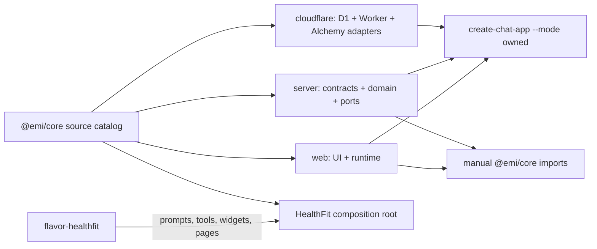
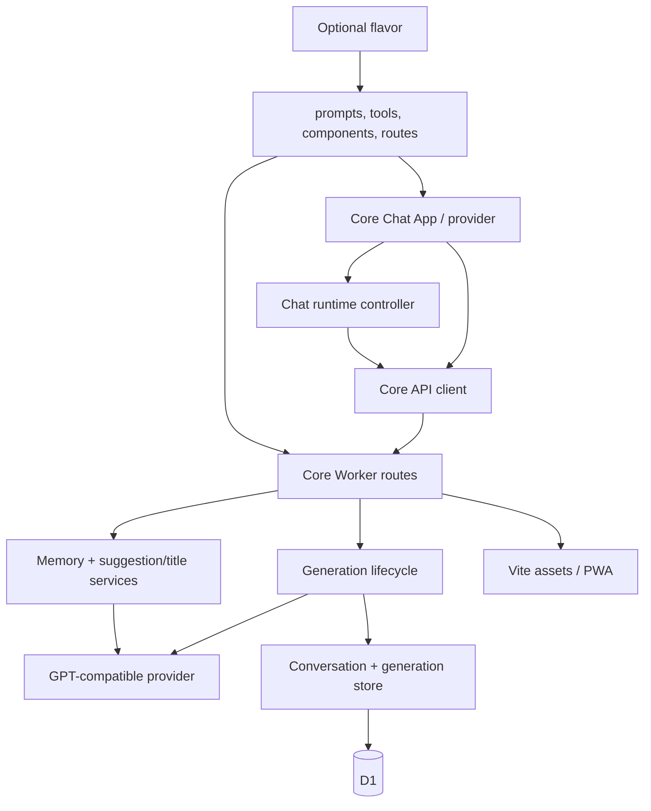
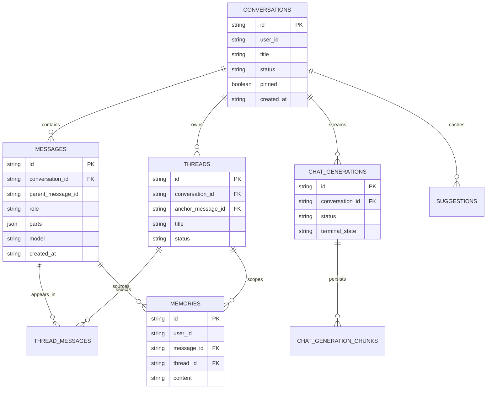

# Core chat platform plan

## Context

- `@emi/core` already owns useful generic contracts, D1 conversation storage, auth helpers, markdown rendering, attachments, conversation-tree utilities, and contribution points.
- The actual generic chat product is still split across `apps/api/src/core/chat`, `apps/api/src/core/routes`, and `apps/chat/app/chat` / `apps/chat/components/chat`. It is therefore not reusable by a new application.
- `apps/generic-web` is only a smoke page and `apps/generic-worker` only lists or creates conversations. `@emi/create-chat-app` generates the same incomplete shell while claiming a much larger feature set.
- HealthFit-specific prompts, tools, data surfaces, and generative widgets must remain in the HealthFit flavor. The reusable core must not import them.

## Goal

Make one source-of-truth generic chat platform that can either be composed through `@emi/core` inside this monorepo or emitted by `create-chat-app` as an independently deployable, user-owned full stack. A generated app must start as a real ChatGPT-like chat application, not a demo shell.

## What

The generic product includes chat UX, browser runtime, server routes, persistence schema, Cloudflare/Alchemy deployment, settings, and documentation. It includes no domain prompt, domain tool, domain page, or provider credential owned by HealthFit.

The initial release covers:

- Composer with text, drag/drop/paste image attachments, model selection, temporary mode, queued follow-ups, and force-send-now.
- Persistent conversations, full-text search, pin/archive/delete, rename, clone, Markdown export/download/share, compact, and start-fresh.
- Message editing/retry/regenerate, branches, branch search/navigation, and a message minimap with previous/top/bottom navigation.
- AI SDK streaming with durable generation chunks, reconnect/resume, stop, diagnostics, and orphan-turn retry.
- Configurable GPT-compatible provider, base URL, API key, default model, default system prompt, cheap title/summary model, and app identity/version/release notes.
- Suggestions, automatic title generation, memory extraction/summary, temporary conversations, light/dark theme, and a tested offline/PWA boundary where it is reliable.
- Generic dynamic-component primitives: safe declarative component envelopes, registry, renderer, validation, persistence, and fallback. HealthFit widgets register through contributions rather than joining core.

## Why

There is a large working chat application, but its value is trapped in one product. New chat products currently either rebuild the same runtime or receive an empty shell. A transparent, owned scaffold gives product teams a ready deployment without locking them into unpublished package internals.

## How

### Conceptual model

`@emi/core` becomes a public source catalog with explicit, stable layers. The CLI builds from those layers in one of two modes:

- `owned` (default) copies documented public source modules and configuration into the generated app. The generated project owns every line it deploys and can change it freely.
- `workspace` emits thin composition roots importing `@emi/core`; this is for this monorepo or a consumer that deliberately vendors/links the package.

Neither mode imports `apps/chat`, `apps/api`, or `flavor-healthfit`.



### Operations / behavior

| Area | Required behavior |
|---|---|
| New conversation | Persist on first non-temporary send; temporary conversations never reach D1. |
| Streaming | Persist generation identity/chunks; reconnect resumes exactly one active generation; stale generation is recoverable. |
| Queue | Draft while streaming creates a queue item; force-send stops current generation and sends selected item immediately. |
| Branching | Editing or forking creates an explicit branch with an anchor; search and navigation retain branch context. |
| Compact/start fresh | Compact saves a summary and preserves auditability; start fresh opens a new conversation with configurable carry-over. |
| Settings | Secret API key stays local by default; provider config is validated and never accidentally exposed through public APIs. |
| Memory | Extraction is opt-in/configurable, deduplicated, attributable to message/thread, inspectable, and deletable. |
| Dynamic components | Only registered schema-validated components render; unregistered or invalid payloads show a safe structured fallback. |

### Tech choices

| Choice | Decision | Rationale |
|---|---|---|
| Distribution | Owned CLI scaffold by default; package composition optional | Meets standalone, no-hidden-stack requirement without forcing npm publishing. |
| Source boundaries | `contract`, `server`, `web`, `cloudflare`, plus a generic `chat` surface where needed | Prevents browser/server/platform/flavor leakage. |
| State | Extract existing XState runtime behind public controller/provider APIs | Existing runtime already handles stream, queue, draft, and session races. |
| Streaming | Keep Vercel AI SDK protocol plus persisted D1 replay chunks | Proven client interoperability and resumable Worker streaming. |
| Persistence | Drizzle schema source of truth; generate migrations only through worker package scripts | Retains existing deployment and migration discipline. |
| Styling | Ship generic primitives/tokens with the scaffold, no HealthFit UI imports | Generated app renders correctly without private aliases or copied app components. |
| PWA | Progressive enhancement with an explicit offline capability matrix | Offline draft/cache is useful; pretending streams work offline is not. |

### Architecture



## What this allows

- Run `create-chat-app my-chat` and deploy a useful chat product with Cloudflare/Alchemy and D1.
- Use `@emi/core` directly for an internal product with custom routing, auth, prompts, and tools.
- Keep core chat improvements shared while keeping HealthFit behavior entirely optional.
- Upgrade generated apps deliberately with a future diffable `create-chat-app upgrade` workflow rather than hidden runtime magic.

## What this does not allow

- A provider hosted by Emi or a shared backend; every generated application deploys its own Worker and D1.
- Copying HealthFit data models, prompts, integrations, branding, or widgets into a generic application.
- Arbitrary executable code in model-generated dynamic components.
- Guaranteed offline model generation; offline support is limited to drafts, cached shell/history, and clear reconnect behavior.
- Automatic propagation of core changes into an owned generated app without an explicit upgrade command and user review.

## UI & UX

### Desktop

```text
┌──────────── conversations ────────────┬────────────── chat ──────────────┬──── map ────┐
│ + New chat   Search                   │ title · model · branch controls  │ user turns  │
│ Pinned / Today / Older / Archived     │                                    │ ▌ question │
│ conversation actions                  │ messages with copy/retry/fork…    │ ▌ question │
│                                        │                                    │ ↑  ↓  top  │
│ Settings · Releases · Theme            │ attachments · composer · queue    │             │
└────────────────────────────────────────┴────────────────────────────────────┴─────────────┘
```

### Mobile

- Sidebar and minimap become sheets opened from the header.
- Composer remains sticky above the keyboard.
- Message actions collapse into a contextual menu; essential retry/copy actions remain one tap away.

### Common interactions

| Action | Result |
|---|---|
| Send during streaming | Adds queued follow-up; user may edit, remove, or force send. |
| Edit a sent message | Revises message and creates/focuses the resulting branch. |
| Click minimap item | Scrolls to the corresponding user message and highlights it briefly. |
| Select temporary | Uses in-memory runtime only and visibly marks chat as temporary. |
| Change default model | Persists locally; new chats select it unless an explicit per-chat model overrides it. |
| Open a release | Shows shipped version, date, changes, and compatibility notes. |

## Data model



The core must add explicit schemas for app settings, release metadata, component envelopes, attachment metadata, and compacted summaries. Persisted APIs use `Schema.Struct`; raw D1 rows remain separate and map through explicit mappers.

## Implementation steps

1. Define public core surface and dependency rules; move generic contracts and Drizzle tables into core without changing generated SQL by hand.
2. Extract generic server chat lifecycle, generation store/replay, provider adapter, suggestions, title/summary, memory services, and generic Worker routes from `apps/api` into `@emi/core`.
3. Extract web API client, XState runtime, conversation controller, sidebar/actions, composer, thread view, minimap, and settings into `@emi/core/web`; replace app-specific aliases/primitives with core-owned equivalents.
4. Add typed contribution contracts for prompts, tools, dynamic component registry, app identity, release data, and optional auth policy. Migrate HealthFit to those contracts.
5. Turn `apps/generic-web` and `apps/generic-worker` into the canonical no-flavor acceptance fixture: full conversation, streaming, settings, and deployment stack.
6. Replace CLI smoke templates with the canonical app generator. Add `--mode owned|workspace`, default `owned`, explicit `--with-pwa`, and a transparent generated-file manifest.
7. Add CLI bootstrap, local dev, migration generation/check, Alchemy deploy, and end-to-end smoke coverage for the owned scaffold.
8. Add a documented upgrade workflow which reports changes and never overwrites user-modified owned files silently.
9. Migrate HealthFit incrementally, deleting duplicated generic source only after contract, SQLite integration, and browser-flow tests prove parity.
10. Publish maintained feature matrix, architecture, extension guide, configuration reference, and generated-app deployment guide.

## Open questions

1. Should generated apps default to anonymous session auth, or expose `--auth anonymous|none|better-auth` with anonymous as the starter? This decides Worker bootstrap and schema contents.
2. Should BYOK settings be browser-local only, encrypted server-side, or selectable by deployer? Local-only is safest for simple personal deployments.
3. Is R2 required in the initial generic scaffold for attachments, or should the first release impose a small inline image limit and add R2 as an opt-in? R2 gives correct persistence but increases deployment surface.
4. What component vocabulary belongs in the first safe dynamic registry: cards, tables, charts, and forms, or only generic rich-result slots?
5. Does “download” mean full conversation Markdown only, or also individual-message Markdown/JSON and attachment files?

## Acceptance criteria

- [ ] `apps/generic-web` renders an interactive chat, not a smoke message.
- [ ] `apps/generic-worker` supports the documented generic HTTP API, generation streaming/replay, auth policy, and Drizzle schema.
- [ ] A generated default app installs, generates/checks its Drizzle migration, runs locally, and deploys with Alchemy without importing HealthFit source.
- [ ] Default generated app supports every feature marked “Core baseline” in `docs/features.md`.
- [ ] Core entry isolation prevents contract/server/web/cloudflare/flavor import leaks; generated app boundaries prevent app-source imports.
- [ ] Stream refresh/reconnect, stop, retry, queued force-send, attachment validation, branches, memory lifecycle, and settings validation have focused real tests.
- [ ] HealthFit behavior remains available through explicit contributions and no generic UI references workout/sport content.
- [ ] `pnpm release:check` passes before each completed extraction revision.

## Decisions log

| Date | Decision | Rationale |
|---|---|---|
| 2026-07-30 | Treat generic chat as a product slice, not a shell component | A shell cannot satisfy a standalone deployable chat application. |
| 2026-07-30 | Default CLI output is owned source; package imports remain optional | Matches the requested transparency while preserving a reusable monorepo library path. |
| 2026-07-30 | Keep generic dynamic components declarative and registry-backed | Allows rich model output without executing model-supplied code. |
| 2026-07-30 | Keep PWA capability progressive and honest | Cached UI/drafts are valuable; AI streaming requires a network connection. |
