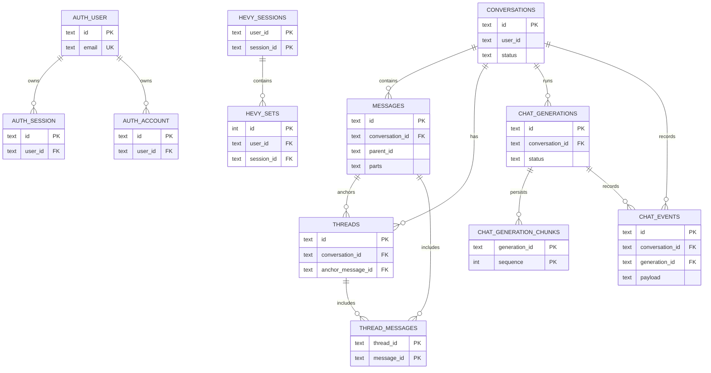

# Database schema map and naming decision

- **Status**: CURRENT
- **Source of truth**: `apps/api/src/db/schema.ts` and `apps/api/src/auth/schema.ts`

## Naming decision

Do **not** rename SQL tables in the slop-cleanup pass. Domain table names are consistently `snake_case`; Drizzle symbols are `camelCase`; Better Auth owns its `auth_*` names. Renaming generic-looking `messages`, `threads`, and `thread_messages` would be cosmetic, requires a generated migration plus deployment/backfill validation, and adds no current correctness or query benefit.

Revisit only if a second message/thread domain is introduced. Then rename through Drizzle schemas, generate the migration with `pnpm --filter @emi/api db:generate`, and run `db:check`; never hand-edit SQL or migration metadata.

## Physical relationship map

Health imports (`daily_activity`, `health_workouts`, `sleep_sessions`, `body_metrics`, `sync_cursors`), memories, notes, suggestions, and privacy preferences are owner-scoped by `user_id` but have no physical foreign key to `auth_user`; the diagram intentionally does not claim one.

## Use this map

- Update this document whenever the Drizzle schema gains/removes a table or foreign key.
- Treat the Drizzle schema, not this Mermaid diagram or migration SQL, as authoritative.
- When persisted JSON columns (`messages.parts`, `chat_generation_chunks.chunk`, `chat_events.payload`, `suggestions.suggestions`) change, add contract encoding tests and real SQLite assertions.
