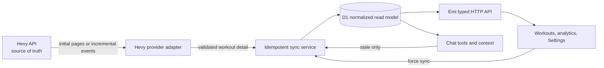
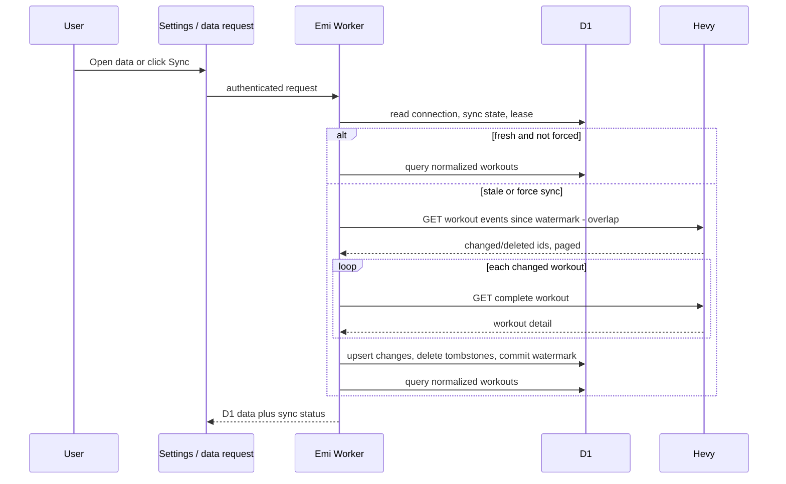
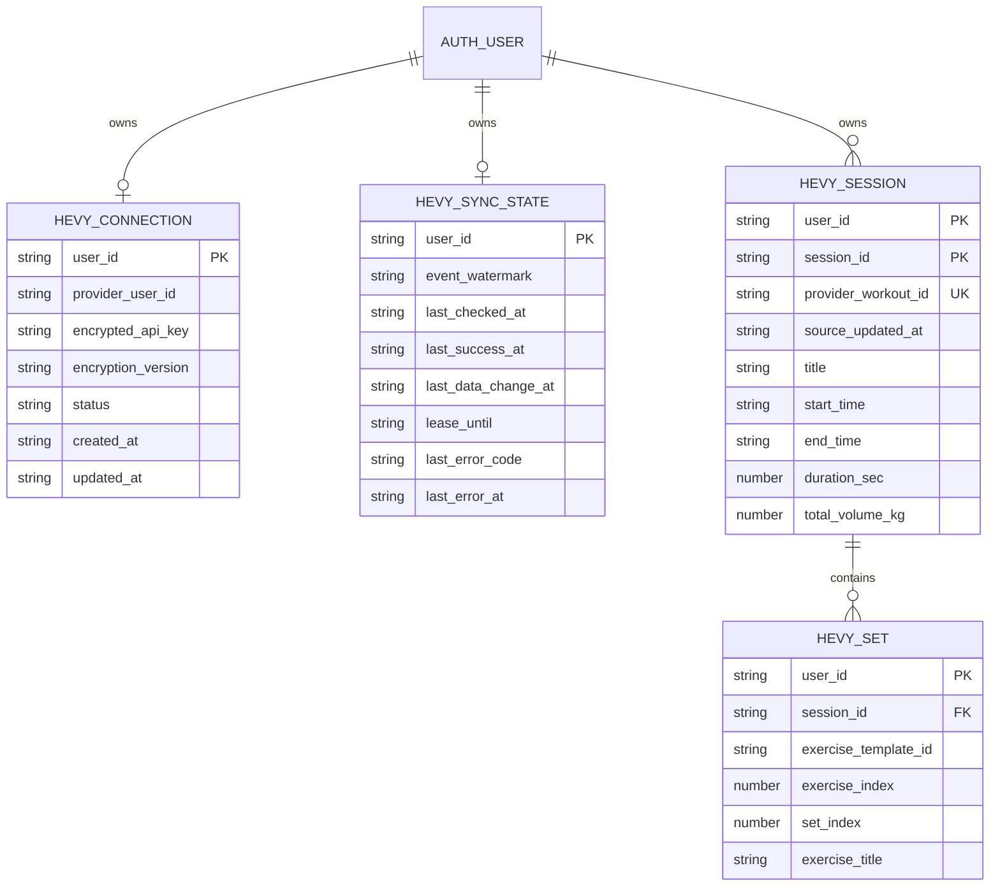

# Hevy API sync plan

## Context

- Emi HealthFit already imports a Hevy CSV into owner-scoped D1 tables: `hevy_sessions`,
  `hevy_sets`, and `sync_cursors`. The CSV parser creates a synthetic session id from title and
  start time. Parsed data powers the Workouts page, analytics, chat context, and existing
  server-side fitness tools. Raw CSV uploads are retained in R2 under the existing privacy policy.
- The API is an Effect-based Cloudflare Worker backed by D1 and R2. The React app consumes the
  typed HTTP API from `packages/api-contract`; Settings already exists as the natural integration
  surface.
- Hevy Pro exposes an API-key API. Its documented `GET /v1/workouts/events` endpoint returns
  paginated update/delete events since a timestamp, specifically for keeping a local workout cache
  current. A client can fetch complete details for an affected workout with
  `GET /v1/workouts/{workoutId}`. Pages are limited to ten items for workouts and workout events.
  See [Hevy API docs](https://api.hevyapp.com/docs/) and the useful, but deliberately unadopted,
  [hevy-mcp reference implementation](https://github.com/chrisdoc/hevy-mcp).
- Hevy labels the public API experimental and says its structure may change. Provider requests and
  decoding must therefore sit behind one small, tested adapter instead of leaking into UI, chat,
  database queries, or an MCP surface.

## Goal

Make the app's D1 database the fast, reliable read model for Hevy data while keeping it fresh from
Hevy through secure incremental synchronization, a visible manual Sync button, and bounded
on-demand refreshes.

Hevy remains the source of truth for workouts in this phase. Emi HealthFit owns its normalized
copy, derived analytics, and its read API; it does not become a competing workout editor yet.

## What

### In scope

- A per-user Hevy connection that securely stores an API key server-side.
- An initial full import, followed by idempotent incremental workout synchronization using Hevy's
  events endpoint and individual-workout reads.
- Deletion propagation, pagination, cursor overlap, per-user sync coalescing, error status, and
  safe fallback to the last successful D1 data.
- A typed Emi API for connection status, connect, manual sync, and disconnect; existing workout,
  analytics, and chat reads remain D1-only after freshness is checked.
- A Settings card to connect, show health/last sync/error, manually sync, disconnect, and remove
  locally cached Hevy data.
- Provider response schemas, mapping, integration tests, observability, privacy behaviour, and
  documentation.

### Deliberately deferred

- Installing, proxying, or depending on `chrisdoc/hevy-mcp`.
- A public/self-hosted MCP endpoint. A future MCP server must call the same Emi D1-backed domain
  service, never expose the Hevy key or bypass synchronization.
- Workout, routine, template, or body-measurement writes from Emi to Hevy.
- A scheduled Cloudflare sync in the first release. The on-demand and manual paths give fresh data
  whenever it is used without a globally privileged job polling every user's credential.
- Syncing routines, folders, exercise templates, exercise history, and body measurements. They can
  become separately versioned provider resources after workout sync has proven stable.

## Why

Calling Hevy directly for every page, tool call, or chat request makes normal reads slower, weaker
when Hevy is unavailable, and harder to combine with Apple Health. A local read model gives one
query boundary for workouts, analytics, privacy deletion, and AI context.

Blindly re-fetching all workouts is unnecessary. The event feed is precisely the cheap change check
proposed here: fetch events only when the local cache is stale; if there are no events, keep using
D1. If there are changes, fetch only changed workout details, apply updates/deletes, then query D1.
The Sync button is still valuable: it bypasses the freshness window and gives the user control and
clear feedback.

## How

### Conceptual model



The stored Hevy key is used only by the provider adapter. All user-facing responses, chat tools,
and a future MCP adapter read D1. A failed refresh never deletes or obscures the last successful
local data; it returns a stale/degraded status alongside the data where appropriate.

### Synchronization behaviour

1. **Connect and validate.** Settings sends the API key once over the authenticated HTTPS API.
   The Worker validates it with `GET /v1/user/info`, encrypts it, stores only redacted connection
   metadata, and starts an initial sync. Never put the key in localStorage, query strings, logs,
   R2, exports, chat context, or API responses.
2. **Initial sync.** Page through `GET /v1/workouts` using the documented maximum page size. Fetch
   complete detail for every workout when the list response is not sufficient for the normalized
   schema. Validate every provider payload before mapping it. Do not mark the connection current
   until all pages and writes complete.
3. **Incremental sync.** Read the saved event watermark, request
   `GET /v1/workouts/events?since=<watermark-minus-overlap>` across every page, deduplicate the
   overlap, and process events in a stable order. For an update event, fetch the complete workout
   by id and upsert it. For a deletion event, remove the workout and its sets locally. Advance the
   watermark only after the entire run succeeds. The small inclusive overlap handles equal
   timestamps, retries, and races; idempotent upserts make replay safe.
4. **Stale-on-demand.** Before workout-dependent UI reads, analytics reads, or chat-context/tool
   reads, call `ensureHevyFresh` only when the last successful check exceeds a central freshness
   policy (initially 15 minutes). It synchronizes first, then reads D1. A provider failure records
   a redacted status and still serves the previous D1 result rather than failing the core request.
   A fresh local cache causes no Hevy request.
5. **Manual sync.** `POST` sync is forceful: it bypasses the freshness policy, waits for the run,
   returns counts plus `startedAt`/`completedAt`/`lastError`, and invalidates affected client query
   keys. The button disables while that user has an active sync.
6. **Concurrency and failure.** Acquire a per-user D1 sync lease before network requests. A second
   caller joins/reports the existing run rather than duplicating calls. Expire abandoned leases
   conservatively. Apply changes and cursor state atomically where D1 permits; leave the previous
   cursor untouched on any page/decode/detail failure. Bound detail-fetch concurrency, use a
   timeout, classify auth/rate-limit/provider/validation errors, and never log response bodies or
   credentials.
7. **Future periodic sync.** Add an opt-in daily scheduled sync only after observing that
   stale-on-demand is not sufficient. It must enumerate only connected users, respect a per-user
   interval and lease, use the same service, and report failures. It must not become a separate
   implementation or a reason to expose credentials to clients.

### Tech choices

| Choice | Decision | Rationale |
|---|---|---|
| Runtime reads | D1 only | Fast, provider-independent, owner-scoped, and composable with existing Apple Health data. |
| Change detection | Hevy workout event feed | It is purpose-built for incremental cache synchronization; do not use workout count or polling every data query. |
| Freshness | connect + manual + stale-on-demand | Current data when needed, no duplicate cron system or permanent provider dependency. |
| Scheduled sync | Defer | No user value proven yet; it adds credential-wide background execution and failure operations. |
| Provider boundary | Internal Effect service with Effect Schema decoders | Hevy describes the API as unstable; isolates API changes and protects database/UI contracts. |
| Credential storage | AES-GCM encrypted value in D1, key from Worker secret | The API key is long-lived and must not be in the browser or plaintext database. |
| External MCP | No dependency in MVP | Own API/DB control; a later MCP layer reuses local data and auth instead of forwarding the key to a third party. |
| Writes to Hevy | Read-only MVP | Keep one owner for mutation semantics; users continue recording/editing in Hevy and sync changes back. |

### Architecture



### Provider adapter and data mapping

- Create a narrowly scoped `HevyClient`/`HevySync` Effect service. It owns `api-key` headers,
  request timeout, pagination, retries only where idempotent, and decodes every response through
  Effect Schema. Its public operations are `validateConnection`, `listInitialWorkouts`,
  `listWorkoutEvents`, and `getWorkout`.
- Map Hevy's `distance_meters` to the existing `distance_km` explicitly. Preserve its canonical
  workout id, exercise template id, source update timestamp, exercise order, set order, title,
  times, notes, type, weight, reps, RPE, distance, and duration. Do not cast parsed JSON.
- Extend the existing import mapper so the old CSV flow and new API flow produce the same fitness
  read shape. CSV remains supported and is visibly labelled as a legacy/manual import source.
- The current set key (`session_id`, exercise title, set index) can collide when a workout contains
  the same exercise title more than once. The API migration must add a stable exercise position and
  canonical provider workout identity before API data is written. Do not rely on display titles as
  remote identifiers.
- Reconcile an existing CSV session to an API workout only when title and normalized start time
  match unambiguously; attach the provider id and reuse its local session. Leave ambiguous legacy
  rows untouched and surface their count rather than silently merging or deleting user data.

## What this allows

- The Workouts page, analytics, existing AI tools, and chat context can read quickly and
  consistently from a single owner-scoped database.
- A user can see and control exactly when a refresh happens, while stale-on-demand sync keeps
  normal usage current without manual exporting.
- Updating or deleting a workout in Hevy propagates to Emi on the next successful sync.
- A future MCP server can expose focused, D1-backed read tools and cite the same data without a
  third-party hosted MCP handling a Hevy credential.
- Future routine/template/measurement synchronization can reuse the connection, cryptography,
  provider client, status model, and sync runner.

## What this does not allow

- Offline workout entry, editing workouts from Emi, or bidirectional conflict resolution.
- A promise of real-time updates while Emi is idle; new Hevy data appears on manual or stale-demand
  sync in this release.
- A direct browser-to-Hevy request or a public endpoint that exposes provider payloads/keys.
- Replacing all existing manual CSV history automatically when a connection is added.
- A generic MCP surface before Emi authentication, data contracts, and read APIs are stable.

## UI & UX

### Desktop

Add a **Hevy** card to Settings above the existing data export/import and privacy controls.

```text
┌ Hevy ───────────────────────────────────────────────────────────────┐
│ Connected as Ada  •  Up to date                                      │
│ Last checked 2 min ago · Last data change 18 Jul 2026, 18:42         │
│ [Sync now]                                                          │
│                                                                      │
│ [Disconnect]                 [Remove all cached Hevy data…]         │
└──────────────────────────────────────────────────────────────────────┘

Disconnected:
┌ Hevy ───────────────────────────────────────────────────────────────┐
│ Connect your Hevy Pro API key. It is encrypted and stays on server. │
│ API key [••••••••••••••••••••]  [Connect and sync]                  │
└──────────────────────────────────────────────────────────────────────┘
```

### Mobile

Use the same card in a single column. Buttons stack full width, status wraps without hiding the
last successful sync time, and key input uses a password field with paste support. The destructive
data-removal confirmation remains a modal/sheet with explicit consequences.

### Common interactions

| Action | Result |
|---|---|
| Connect and sync | Validate key, persist encrypted connection, show determinate/in-progress state, then counts and timestamp. |
| Sync now | Force one coalesced incremental run; show no-change, updated, deleted, or recoverable error state. |
| Browse workouts or ask a workout question | Check freshness; sync only if stale; render D1 data even when refresh failed. |
| Disconnect | Delete encrypted key and sync state; keep normalized historic data for the user to retain. |
| Remove cached Hevy data | Require confirmation, then remove connection, sync state, sessions, sets, and optional raw CSV uploads using the existing privacy path. |
| Invalid/revoked key | Mark connection action-required, preserve local data, explain reconnect action, and never echo the key or upstream body. |

## Data model



Implementation details:

- Generate all structural changes from `apps/api/src/db/schema.ts` with the required Drizzle
  workflow. Never hand-edit SQL migrations or Drizzle metadata.
- Keep `session_id` as Emi's internal foreign-key identity and add nullable canonical
  `provider_workout_id` for API rows. New API sessions can use a deterministic local id such as
  `hevy:<provider-id>`; legacy CSV sessions retain their current ids until safely reconciled.
- Replace the set uniqueness rule with `(user_id, session_id, exercise_index, set_index)`, while
  retaining display title and new provider identifiers as ordinary fields. Generate the necessary
  table rebuild migration and test it against legacy rows.
- Separate *last checked*, *last successful*, *last data change*, and *event watermark*. The
  existing generic `sync_cursors.last_sync` is insufficient for retry-safe provider events; retain
  it only if existing summary/export compatibility needs it, otherwise migrate summary reads to
  `hevy_sync_state`.
- Store an encrypted credential envelope (version, random IV, ciphertext) rather than a plaintext
  `encrypted_api_key` string in a single column if that makes Web Crypto rotation clearer. The
  exact columns should follow the chosen typed envelope schema.

## API and domain boundaries

Add a typed `HevyIntegrationApi` group to `packages/api-contract` and register matching handlers
from `apps/api/src/http-api-data.ts` or a focused integration handler:

- `GET /api/integrations/hevy` — connection and sync status only; never key or raw provider data.
- `PUT /api/integrations/hevy` — accept API key, validate, encrypt, save, and perform initial sync.
- `POST /api/integrations/hevy/sync` — force incremental sync and return a bounded summary.
- `DELETE /api/integrations/hevy` — disconnect only, preserving local history.
- `DELETE /api/integrations/hevy/data` — delete credential and all Hevy-derived local data after
  client confirmation; coordinate with the existing `/api/privacy/data/hevy` semantics.

`ensureHevyFresh` is an internal service used by workout/analytics/chat read entry points. Do not
make it an unbounded request middleware: only call it on data that actually depends on Hevy and
honour a central timeout/freshness policy. Existing clients continue to consume their typed workout
and analytics responses from D1.

## Privacy, security, and reliability

- Add `HEVY_CREDENTIAL_ENCRYPTION_KEY` as a redacted Worker secret. Use a versioned AES-GCM
  envelope with a fresh IV per save and user id as additional authenticated data. Validate its
  format at Worker startup. Document key rotation as decrypt/re-encrypt during the next successful
  authenticated sync.
- The Hevy key is a password-equivalent long-lived secret. Redact headers, request URLs, keys, and
  provider bodies from diagnostics and error logs. Never make it a Worker environment variable
  shared across users.
- Persist normalized workouts only; do not store raw API payloads in R2 by default. Existing CSV
  retention remains governed by the current setting.
- `Disconnect` removes the secret; `Remove cached Hevy data` removes the secret, sync metadata,
  normalized rows, and raw CSV uploads. Exports include normalized Hevy data but never a key,
  encryption envelope, or provider response body.
- Cache invalidation must cover summary, workout, analytics, and any chat context cache after a
  successful data-changing sync. Scope all tables and deletes by authenticated user id.

## Implementation steps

1. Re-read current [official Hevy OpenAPI documentation](https://api.hevyapp.com/docs/) at
   implementation time, capture sanitized fixtures for list/events/detail/delete responses, and
   record API error/rate-limit behaviour. Confirm fields and event ordering before finalizing
   decoder/migration names.
2. Design the encrypted credential envelope and add the Worker secret configuration, redaction
   coverage, and connection/sync-state Drizzle schema. Add provider identifiers and collision-safe
   set identity to the existing Hevy tables. Generate the migration with
   `pnpm --filter @emi/api db:generate`, then validate it with
   `pnpm --filter @emi/api db:check`.
3. Implement `apps/api/src/integrations/hevy/` (or equivalent) as Effect services: Web Crypto
   encryption, validated HTTP client, pagination, typed provider response schemas, normalized
   mapper, and redacted qualified errors. Keep the CSV parser as a separate manual-import mapper.
4. Implement initial/backfill, incremental event processing, inclusive-overlap deduplication,
   deletion handling, sync lease, atomic cursor updates, failure preservation, and legacy CSV
   reconciliation. Extend database write helpers rather than putting persistence in route code.
5. Add the typed HTTP contract and authenticated handlers for status/connect/sync/disconnect/data
   removal. Integrate `ensureHevyFresh` only at Hevy-dependent workout, analytics, and chat/tool
   read boundaries. Invalidate server/client caches after successful changes.
6. Build the Settings Hevy card with password input, status, forced Sync now, reconnect guidance,
   and separate disconnect versus destructive data removal flows. Add focused UI tests.
7. Extend privacy/export/delete behaviour, API documentation, and operational runbook: secret
   provisioning, key rotation, connection recovery, manual retry, and how to inspect redacted sync
   health.
8. Add focused unit, contract, and real SQLite integration tests; run targeted checks while
   working. Before handoff, run `pnpm release:check` once on the final worktree.
9. Review actual latency, error, and freshness metrics after usage. Only then decide whether an
   opt-in scheduled worker or a D1-backed MCP read adapter is warranted.

## Open questions

- Confirm live Hevy API response fixtures and rate-limit/error headers immediately before coding;
  its published API is explicitly unstable. The plan deliberately avoids assuming undocumented
  event object fields.
- Confirm product policy for legacy CSV rows that cannot be matched unambiguously to API workouts:
  retain and report them is the safe default.
- Confirm a user-facing freshness label: `up to date`, `checked`, and `last data change` are more
  accurate than implying a continuously real-time connection.

## Acceptance criteria

- [ ] A user can connect a valid Hevy Pro key without it appearing in browser storage, logs,
  exports, R2, diagnostics, or any response.
- [ ] Initial sync imports every paginated workout, preserves complete supported workout/set data,
  and safely retains unmatched legacy CSV rows.
- [ ] A stale or forced sync uses workout events, fetches only changed workout details, applies
  deletions, paginates completely, and does not advance its cursor on a partial failure.
- [ ] A zero-event check makes no workout-row changes and subsequent UI/chat/tool reads use D1.
- [ ] Workouts, analytics, and chat see current D1 data after successful sync and still return the
  last successful D1 data if Hevy is temporarily unavailable.
- [ ] Concurrent sync requests for one user are coalesced; users cannot read or affect each other's
  connection, cursor, or workouts.
- [ ] Settings exposes clear connect, sync, stale/error, disconnect, and destructive remove-data
  states on desktop and mobile.
- [ ] Disconnect removes the credential but retains history; remove-data deletes all Hevy-derived
  records and credentials after confirmation.
- [ ] Contract decoders, mapper tests, pagination/deletion/retry tests, real SQLite ownership and
  migration tests, focused UI tests, and final `pnpm release:check` pass.

## Decisions log

| Date | Decision | Rationale |
|---|---|---|
| 2026-07-19 | Use Hevy as source of truth and D1 as Emi read model. | Gives local performance/reliability while preserving Hevy's workout ownership. |
| 2026-07-19 | Use the workout event feed, not count checks or direct provider reads on every query. | The provider documents events specifically for incremental local-cache sync. |
| 2026-07-19 | Sync on connect, explicit request, and stale demand; defer cron. | Freshness when used, fewer credentials-wide background concerns, less operational complexity. |
| 2026-07-19 | Add a manual Sync now button. | Gives immediate control and transparent freshness status. |
| 2026-07-19 | Do not adopt `hevy-mcp` as a production dependency. | Its scope validates the API opportunity, but Emi needs its own auth, data model, privacy, and D1-first boundary. |
| 2026-07-19 | Keep MVP read-only from Emi to Hevy. | Avoids bidirectional conflicts and makes external mutation semantics explicit later. |
