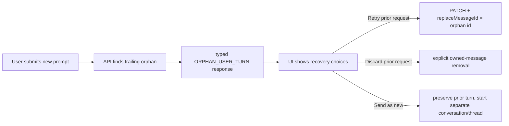

# Orphan user turn recovery plan

## Context

On 2026-07-17, after a generation had been incorrectly left unfinished, Emi opened conversation `102f88a7-d639-4375-a69c-ecac0cc335ae` and received:

```json
{
  "error": "Previous user turn has no assistant response.",
  "code": "ORPHAN_USER_TURN",
  "orphanMessageId": "30dd4f3b-02af-4168-83cc-f70d395c715c",
  "actions": ["retry", "discard", "send-as-new-turn"]
}
```

The API correctly prevents a new request from being silently appended after an unanswered user turn. The browser treats the `409` as a generic transport error, displays raw JSON, and its existing “Retry last turn” targets the newly-unsaved message rather than `orphanMessageId`. The advertised recovery actions have no UI implementation.

The orphan was created by the separate stream-finalization incident documented in [prod-chat-generation-timeout.md](./prod-chat-generation-timeout.md).

## Goal

Make an orphaned user turn recoverable from the chat UI without losing either prompt, while preventing it from recurring when a provider-completed stream loses its final UI chunk.

## What

Deliver an immediate typed recovery for `ORPHAN_USER_TURN`: show a clear recovery card and retry the persisted orphan message by id. Follow with explicit discard and send-as-new-turn actions, and fix the server-side finalization gap that created this orphan.

## Why

The current server protection avoids corrupted conversation order, but presents a raw API object and leaves the user unable to follow its own listed actions. A completed provider response must also never become an orphan in the first place.

## How

### Conceptual model



### Operations / behavior

1. Parse the `409` body in the chat transport into a typed orphan error, preserving only the validated message id and safe display text.
2. Render a human-readable recovery state. “Retry previous request” invokes the existing revision path with `replaceMessageId` equal to the persisted orphan id; it removes the optimistic blocked new prompt and sends the original prompt exactly once.
3. Keep generic transport errors unchanged. Never infer an orphan from error text alone.
4. Add explicit owned server operations for discard and send-as-new-turn before exposing those buttons. They must validate conversation/message ownership and preserve thread consistency.
5. Implement the idempotent provider/UI-stream finalizer from the companion plan so successful provider output commits an assistant message and terminal generation state before stale cleanup can create an orphan.

### Tech choices

| Choice | Decision | Rationale |
| --- | --- | --- |
| Error contract | Typed `409` payload parsed at transport boundary | Avoids raw JSON and brittle message matching. |
| Immediate action | Retry persisted orphan by `replaceMessageId` | Reuses validated server revision behavior; does not merge prompts. |
| Discard/new action | Separate reviewed API operations | Deleting or moving persisted user data must be explicit and ownership-scoped. |
| Prevention | Idempotent generation finalizer | Recovery alone cannot prevent a repeat of this incident. |

## What this allows

- A user can recover the unanswered request with one explicit action.
- The blocked new optimistic prompt is not accidentally persisted or sent as the orphan retry.
- Future action buttons can rely on an actual server contract.

## What this does not allow

- It does not silently discard a user prompt.
- It does not treat every `409` as an orphan.
- It does not repair historic production rows without explicit approval and a reviewed workflow.

## UI & UX

### Desktop

Replace raw JSON with: “Your previous request did not receive a response.” Show **Retry previous request** and **Dismiss** now. Add **Discard previous request** and **Send this as a new conversation** only after their backed operations ship.

### Mobile

Use the same inline recovery state and large tap targets; no modal required.

### Common interactions

| Action | Result |
| --- | --- |
| Retry previous request | Replaces and resubmits the persisted orphan id. |
| Dismiss | Leaves persisted history unchanged; user can retry later. |
| Discard previous request | Future: explicitly removes only the orphan and dependent generation history. |
| Send as new conversation | Future: preserves orphan and opens a new isolated conversation. |

## Data model

The immediate retry needs no schema change. It uses existing `messages.id`, `messages.user_id`, `chat_generations`, and the already-supported `replaceMessageId` request field.

Discard must be designed as an ownership-scoped application operation; do not manually alter production D1 rows.

## Implementation steps

1. Add an E2E fixture returning the exact `409 ORPHAN_USER_TURN` payload for a conversation with a persisted trailing user message.
2. Parse that payload in `ChatRuntimeProvider`, retain its `orphanMessageId`, and render a dedicated retry action.
3. Reuse `runtime.revise` with the persisted id; ensure its XState revision path removes the blocked optimistic new prompt before retrying.
4. Add browser E2E assertions for user-facing copy, PATCH target, `replaceMessageId`, and successful assistant replay.
5. Add an API/Worker stream E2E fixture for provider `stop` plus a missing UI `finish` chunk; assert one assistant message and `completed`, never stale `timed_out`.
6. Add a browser E2E reload/reconnect assertion for that fixture, including no orphan recovery card after finalization succeeds.
7. Design, test, and ship discard/send-as-new endpoints and their UI actions as a follow-up.

## Open questions

1. For send-as-new-turn, should the new prompt be moved to a new conversation or copied into a fresh thread in the same conversation?
2. What retention/audit behavior is required when discarding an orphan with persisted generation chunks?
3. Does the provider-finalization test run against a local Worker/D1 harness or a dedicated dev deployment?

## Acceptance criteria

- [ ] Exact `ORPHAN_USER_TURN` `409` displays clear recovery copy, never raw JSON.
- [ ] Retry targets `orphanMessageId`, not the optimistic blocked prompt.
- [ ] E2E verifies the retry sends one replacement generation and shows its assistant response.
- [ ] E2E verifies provider `stop` plus missing UI `finish` ends as a durable assistant result or explicit finalization failure, never a delayed generic timeout.
- [ ] E2E reload/reconnect verifies no new prompt can silently absorb an orphaned prompt.
- [ ] Discard and send-as-new are unavailable until their server operations are implemented and ownership-tested.

## Decisions log

| Date | Decision | Rationale |
| --- | --- | --- |
| 2026-07-17 | Ship typed retry before destructive recovery actions | It is safe, reuses the existing revision contract, and directly unblocks the user. |
| 2026-07-17 | Keep orphan blocking server-side | Preventing silent prompt merging is correct; the missing piece is usable recovery. |
| 2026-07-17 | Treat stream finalization as a separate prevention fix | UI recovery cannot replace durable provider completion. |
