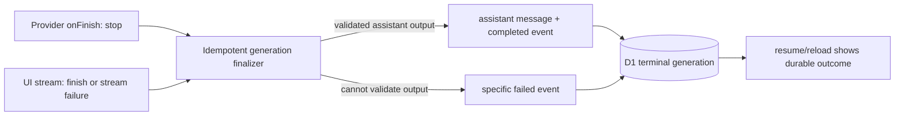

# Prod chat generation timeout plan

## Context

Production conversation `102f88a7-d639-4375-a69c-ecac0cc335ae` failed on 2026-07-17.

- The provider finished normally at `14:27:37 UTC` with `finishReason: stop` after 7 seconds, consuming 12,667 input and 355 output tokens.
- D1 persisted 246 UI chunks, but the final chunk was a `text-delta`; it never stored `text-end` or `finish`.
- The assistant message was not committed. The result is an orphaned user turn.
- `persistGenerationStream` only marks a generation terminal after its UI stream closes. It never did, so the existing five-minute stale-generation maintenance later changed it to `timed_out` with `Generation timed out`.
- Browser refresh/reconnects happened after the provider finished; this was not a provider failure. They could not repair the non-terminal persisted state.

This confirms a finalization gap in the current `waitUntil` + streamed-UI-chunk design. It does not yet prove why the terminal UI chunk was absent: Worker lifetime, stream encoding, or response/proxy interruption remain possible causes.

Related work: [durable-chat-execution.md](./durable-chat-execution.md) describes the longer-term ownership change. This plan makes the current path correct and diagnosable first.

## Goal

A provider-completed turn must commit one recoverable assistant outcome and a terminal generation state, even when the browser stream ends without its final UI chunk. No completed provider turn may later surface as a generic timeout.

## What

Add one idempotent generation finalizer, used by both the provider completion callback and UI-stream persistence. It will atomically record the assistant outcome, provider metadata, terminal state, and exactly one terminal event when enough validated output exists.

If output cannot be finalized safely, record a specific terminal failure immediately. Do not leave an ambiguous `streaming` row for stale cleanup to mislabel later.

## Why

This incident hid a successful provider result and discarded the visible assistant reply. It made the user retry after a long wait while leaving history inconsistent. The existing stale timeout is appropriate for an interrupted provider call, but false for an already-finished provider response.

## How

### Conceptual model

The provider finish signal is evidence, not by itself success. Success requires a durable assistant result. Either finalization path may arrive first; only the first valid terminal transition commits it.

### Operations / behavior

1. Refactor `handleAiSdkChat` and `persistGenerationStream` to call one terminalization helper rather than independently writing state/events.
2. On provider `onFinish`, validate and persist the assistant result. Prefer the provider's structured assistant messages; for a non-empty text-only result where those are absent, use a tested, schema-valid text fallback. Do not synthesize unsupported tool or reasoning parts.
3. Commit assistant persistence, generation metadata, terminal state, and terminal event in one D1 batch/transactional unit. Guard the generation transition so a second finalizer is a no-op and cannot produce duplicate messages/events.
4. When the UI stream emits `finish`, reconcile its finish reason and chunk checkpoint with that same finalizer. When it ends/errors without `finish`, mark a clear persistence-finalization failure only if provider finalization did not already succeed.
5. Change stale reconciliation to preserve an already-finalized provider outcome. It must never convert a durably completed generation to `timed_out`.
6. Add structured telemetry for `provider.finished`, final UI chunk type/sequence, assistant-message commit count, finalizer owner/outcome, and `waitUntil` interruption. These fields share generation, request, and trace IDs.
7. Keep the existing resume endpoint, but make it return the stored terminal state immediately. The client displays the recovered assistant reply or an explicit retryable finalization error, never an indefinite spinner.

### Tech choices

| Choice | Decision | Rationale |
| --- | --- | --- |
| Terminal authority | Idempotent D1 finalizer | Prevents a missing UI `finish` chunk from deciding user-visible state. |
| Assistant fallback | Text-only, schema-validated fallback | Recovers this incident shape without inventing tool/reasoning data. |
| Immediate execution owner | Retain `waitUntil` with correctness guard | Small, low-risk incident fix; does not claim `waitUntil` is durable. |
| Long-term execution owner | Durable Object, per existing plan | Makes execution survive Worker lifecycle and disconnected browsers. |

## What this allows

- A normal provider completion remains visible after refresh or reconnect.
- A malformed or interrupted stream reports an immediate, diagnosable finalization failure.
- Operators can distinguish provider failure, assistant-persistence failure, and UI-stream interruption from D1 and Worker telemetry.

## What this does not allow

- It does not make `waitUntil` durable across arbitrary Worker termination; follow the Durable Object migration plan for that guarantee.
- It does not silently repair historic conversations or fabricate non-text assistant/tool content.
- It does not manually mutate production D1 data.

## UI & UX

### Desktop

Existing chat layout stays unchanged. On reload, render the persisted assistant message when finalization recovered it. If recovery is unsafe, show a precise retry affordance tied to the stored generation rather than placing a generic timeout in the composer.

### Mobile

Same states and retry behavior as desktop; no separate flow.

### Common interactions

| Action | Result |
| --- | --- |
| Refresh during a completed turn | Replay durable assistant result and terminal status. |
| Disconnect before UI `finish` | Server finalizer completes from validated provider output, or records a specific failure. |
| Retry a specific finalization failure | Starts one new generation; does not merge the orphaned prompt with a later prompt. |

## Data model

No schema migration is needed for the immediate fix. Existing `chat_generations`, `messages`, `chat_generation_chunks`, and `chat_events` remain the source of truth. The invariant becomes:

| Provider state | Assistant outcome | Generation state |
| --- | --- | --- |
| Finished with validated result | Exactly one persisted assistant message | `completed` |
| Finished without safely recoverable result | No fabricated message; explicit terminal event | `failed` |
| Provider genuinely interrupted | No validated result | `failed`, `cancelled`, or `timed_out` as appropriate |

## Implementation steps

1. Add a focused incident fixture: provider `stop` with text output, persisted text chunks lacking `finish`, no assistant message, and a later resume.
2. Implement the idempotent finalizer and route both `onFinish` and `persistGenerationStream` terminal paths through it.
3. Add the validated text-only assistant fallback and explicit failure branch; preserve existing structured-message behavior.
4. Make terminal state/event writes conditional and add telemetry for finalizer path and missing terminal chunks.
5. Update resume/reconciliation behavior and tests so terminal provider metadata cannot become a stale timeout.
6. Run focused unit, D1 integration, and disconnect/reconnect stream tests; deploy to dev and verify with `pnpm diagnose:session`.
7. Deploy production, then inspect the new generation telemetry and D1 state for one controlled test turn.
8. Before repairing the affected historic turn, obtain explicit direction for the data backfill. Do not issue ad-hoc D1 writes; use the established, reviewed application workflow.
9. Schedule the Durable Object migration in `durable-chat-execution.md` after the immediate fix is stable.

## Open questions

1. Does the missing UI `finish` originate in AI SDK stream encoding, Worker termination, or the frontend/proxy path? New correlation telemetry must answer this in dev and production.
2. Should a text-only fallback be enabled for all models, or limited to provider completions with a `stop` finish reason and non-empty verified text?
3. Who authorizes historic repair for this and any matching orphaned generations, and what user-facing audit trail is required?

## Acceptance criteria

- [ ] The incident fixture ends `completed` with one assistant message, not `timed_out`.
- [ ] A stream that ends without `finish` becomes either completed via validated provider output or explicitly failed within the request lifecycle; it never waits for stale cleanup.
- [ ] Normal completion produces one assistant message and one terminal generation event despite both finalization paths racing.
- [ ] Refresh/reconnect shows the durable terminal result and never merges unanswered prompts.
- [ ] D1 integration tests cover the terminal transition and raw-row status values.
- [ ] Worker telemetry identifies finalizer path, last chunk type/sequence, and the shared generation/request/trace IDs.
- [ ] Dev replay and a controlled production turn have no orphan-user-turn or generation-failed findings in `diagnose:session`.

## Decisions log

| Date | Decision | Rationale |
| --- | --- | --- |
| 2026-07-17 | Treat missing terminal UI chunk as a persistence-finalization incident | Provider completion is proven by persisted metadata; stale timeout was a false diagnosis. |
| 2026-07-17 | Ship idempotent finalization before Durable Object migration | It corrects current user harm with a contained change while keeping durable execution as the long-term fix. |
| 2026-07-17 | Do not repair production rows during investigation | Historic data repair needs explicit authorization and a reviewed workflow. |
