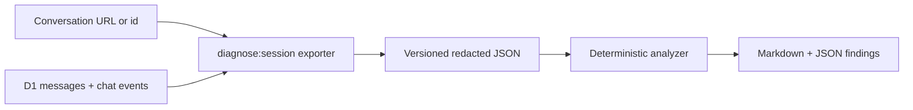
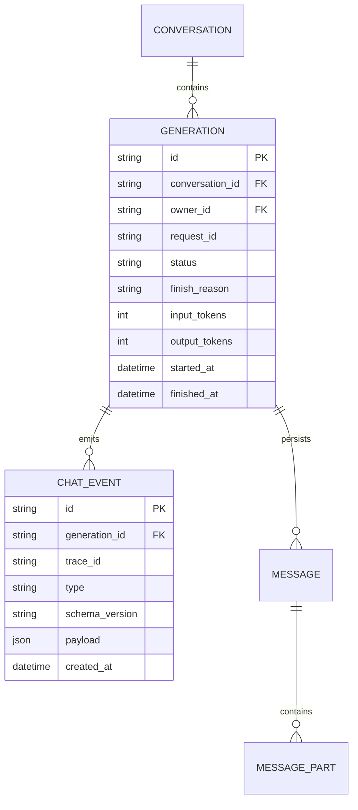

# Session diagnostics and remediation plan

## Context

The persisted chat is rich enough for a manual signed-in browser review, but not for a complete
postmortem: it lacks durable generation state, request and trace ids, provider finish reasons, retries,
chunk timing, and persistence failures. The motivating case study and its product remediation backlog
are recorded in [session-9745-postmortem.md](./session-9745-postmortem.md).

Revision `4fc956d7` already fixed the trailing-semicolon validator bug, documented the SQL tool's real
capabilities, capped a generation at eight tool steps, logged `onFinish` failures, and added validator
tests. The remaining work below should be validated against a new reproduction after that revision is
deployed.

## Goal

Given only a conversation URL or id and an environment name, a developer or automated agent can
produce a redacted diagnostic bundle and deterministic report without controlling the user's browser.
The report must distinguish confirmed evidence from inference and lead directly to a prioritized fix
backlog.

## What

This work has two deliverables:

1. Fix the concrete product failures found in this session.
2. Add an owner-safe diagnostics pipeline that exports, analyzes, and reports any prior session from
   the command line.

The pipeline produces a schema-versioned JSON bundle plus a Markdown report. Browser inspection remains
an optional visual verification step, not a prerequisite for debugging.

## Why

The current workflow requires a signed-in browser, manual expansion of tool cards, and guesswork across
D1 data and ephemeral Worker logs. It is slow, cannot be reproduced reliably by an agent, and loses the
most important evidence when a generation fails.

## How

### Conceptual model



### Bundle contents

- conversation, branch, message, generation, request, and trace ids;
- ordered message parts, including exact tool input, output, and explicit outcome;
- model, per-turn token usage, provider finish reason, and retry count;
- generation status and timestamps, time to first token, total duration, and persisted chunk summary;
- tool duration, normalized error code, and whether another equivalent attempt followed;
- client recovery events: submit, disconnect, reconnect, stop, refresh, and retry;
- persistence and optional-enrichment failures joined through the same ids.

Never include cookies, OAuth tokens, provider keys, raw request headers, or unrelated user data. Tool
arguments and outputs may contain health data, remain owner-only, and are redacted by default in reports.

### Programmatic access without browser control

The primary developer path is:

```text
pnpm diagnose:session --url <conversation-url> --env dev
```

The command extracts the conversation id, uses the developer's existing Wrangler authentication to
read the configured remote D1 database, writes the bundle under ignored `.diagnostics/`, runs the
analyzer, and prints only the report path and summary. This avoids copying cookies or maintaining an
application bearer token.

The owner-facing path is an authenticated `GET /api/conversations/:id/diagnostics` endpoint plus an
**Export diagnostics** conversation action. It uses the normal owner session, verifies conversation
ownership in the repository layer, records the export, and downloads the same bundle schema.

Do not make the endpoint public, accept a user id from the caller, or teach automation to scrape browser
cookies. If Wrangler access is unavailable, fail with setup instructions rather than silently falling
back to browser clicking.

### Analyzer rules

The first deterministic checks are:

- orphan user messages and generations without a terminal state;
- error-shaped tool output displayed or persisted as success;
- repeated identical or equivalent tool failures;
- assistant claims that contradict the tool's normalized error capabilities;
- promises of an immediate tool action with no following tool call;
- render-component inputs that fail the registered component schema;
- abnormal per-turn and conversation token growth;
- missing finish reason, persistence gap, reconnect gap, or timed-out generation;
- unsupported data claims in health recommendations.

LLM-assisted qualitative review may consume the bundle later, but deterministic checks remain the
baseline so the same session always produces the same core findings.

## Data model



## Implementation steps

1. Add `generations` and bounded `chat_events` migrations with owner-scoped repositories and retention.
2. Instrument server, provider, tool, persistence, and client recovery events with shared ids.
3. Implement the versioned bundle schema and owner-authorized HTTP export.
4. Implement the Wrangler-backed `diagnose:session` exporter with `--env`, `--url`, `--output`, and
   `--include-sensitive` flags. Sensitive output requires explicit opt-in.
5. Implement deterministic analyzer rules and Markdown/JSON renderers.
6. Add fixtures and end-to-end tests for successful, tool-failed, disconnected, timed-out,
   provider-failed, and persistence-failed sessions.
7. Document the command, Wrangler prerequisite, data handling, retention, and deletion workflow.

## What this allows

- An agent can debug a supplied conversation URL with one command and no screen control.
- Historical failures remain explainable after Worker logs expire.
- Product regressions become fixtures and deterministic tests rather than anecdotes.
- Owners can export and delete their own diagnostic data safely.

## What this does not allow

- Cross-owner access or a public diagnostics endpoint.
- Exporting secrets, authentication material, or unrelated health records.
- Replaying a tool call with side effects; diagnostics are read-only.
- Treating an LLM judgment as the sole source of a failure classification.

## Acceptance criteria

- [x] `pnpm diagnose:session --url <conversation-url> --env dev` creates a redacted JSON bundle and
      Markdown report without opening a browser.
- [x] The case-study report flags all findings in `session-9745-postmortem.md`.
- [x] Bundle authorization tests prove one owner cannot export another owner's conversation.
- [x] Default reports contain no cookies, OAuth data, provider keys, raw headers, or unrelated records.
- [x] Success, tool failure, disconnect, timeout, provider failure, and persistence failure fixtures are
      deterministic in CI.

## Open questions

1. Should raw event payloads expire with the conversation or on a shorter fixed retention window?
2. Should the analyzer fail CI only for P0 rules, or also for token-budget regressions?
3. Is the owner-facing export needed in the first delivery, or can the Wrangler CLI ship first?

## Decisions log

| Date       | Decision                                                                           | Rationale                                                         |
| ---------- | ---------------------------------------------------------------------------------- | ----------------------------------------------------------------- |
| 2026-07-16 | Use one shared versioned bundle for CLI and UI export                              | Prevents two diagnostic formats from drifting.                    |
| 2026-07-16 | Use Wrangler auth for developer automation                                         | Avoids scraping browser cookies or adding a long-lived app token. |
| 2026-07-16 | Keep deterministic checks as the baseline                                          | Makes reports reproducible and testable.                          |
| 2026-07-16 | Keep browser inspection as an optional fallback                                    | Visual state helps UX review but must not gate debugging.         |
| 2026-07-16 | Retain terminal diagnostics for seven days and cascade deletion with conversations | Bounds durable telemetry while keeping owner deletion complete.   |
