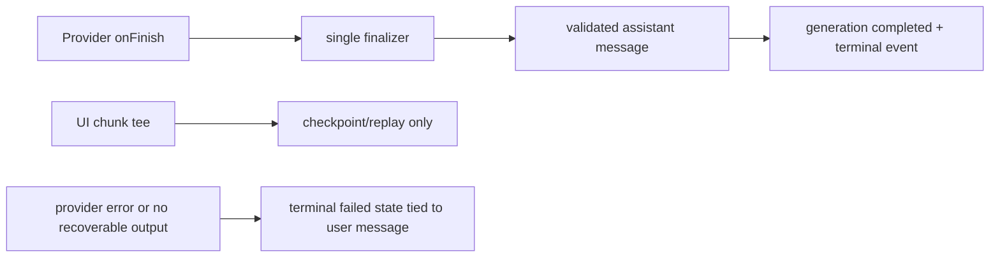

# Stuck chat generation fix plan

## Context

The recovery UI is functioning as designed but exposes the underlying fault:

1. A trailing user message has no persisted assistant response, so a new prompt receives `409 ORPHAN_USER_TURN`.
2. “Retry previous request” resubmits that persisted user message with `replaceMessageId`.
3. The provider can finish, but the current Worker only marks the generation terminal after the secondary `UIMessageStream.tee()` persistence branch receives `finish`.
4. That branch can end without `finish`; no assistant message or terminal state is committed. Stale maintenance later writes `Generation timed out`.
5. Retrying therefore creates the same orphan/timeout loop. The generic composer-level retry also selects `messages.at(-1)`, not the failed persisted user message.

The earlier plan described a finalizer, but it was not implemented. This is the required implementation sequence.

## Goal

Provider completion must durably create exactly one assistant message and terminal generation before the browser stream closes; failures must be attached to the exact user message with a safe retry action.

## What

Make provider `onFinish` the sole owner of successful finalization. UI-stream persistence becomes checkpoint/replay only, never the authority deciding that a generation completed.

## Why

The existing retry UI cannot repair a server state machine that loses the completed result. Fixing that state machine prevents the orphan loop and lets retry be a genuine retry of a failed message.

## How

### Conceptual model

### Operations / behavior

1. In `handleAiSdkChat.onFinish`, derive assistant parts from the structured provider response. If it is empty but `event.text` is non-empty, construct one schema-validated text assistant part. If neither is valid, finalize `failed` with `ASSISTANT_OUTPUT_MISSING`; never leave `streaming`.
2. In that same finalizer, persist the assistant message, provider metadata, `completed` generation state, and one `generation.completed` event. Use one D1 batch/transaction and a conditional terminal update (`pending|streaming` only) so only one caller can commit the terminal event.
3. Remove successful terminalization from `persistGenerationStream`. It continues appending chunks and records a `persistence.failed` diagnostic, but cannot overwrite a provider-finalized result or create a duplicate assistant message.
4. Provider `onError` and finalizer exceptions write a structured terminal failure immediately. `expireStaleGenerations` applies only when neither finalizer nor provider metadata has established an outcome.
5. Resume reload first reads the stored terminal generation/message. A completed generation returns history; a failed one returns a typed failure including `generationId` and the originating `userMessageId`.
6. Replace composer-global retry selection with an error card on the failed user message. Its retry uses that exact persisted `messageId` as `replaceMessageId`; disable its button while that generation is active. Keep “send as new conversation” separate and explicit.

### Tech choices

| Choice | Decision | Rationale |
| --- | --- | --- |
| Success authority | Provider `onFinish` finalizer | It is the only confirmed completion signal in this incident. |
| Empty structured response | Validated `event.text` fallback | Saves the proven text-only incident without fabricating tool/reasoning parts. |
| UI stream tee | Replay/checkpoint only | A missing UI `finish` cannot erase a successful provider result. |
| Failure UX | Message-scoped typed error | Retry must identify the original persisted user turn. |

## What this allows

- A reload after provider completion shows its assistant response, even if the browser stream was truncated.
- A genuine failure has one deterministic retry target.
- The `ORPHAN_USER_TURN` UI becomes exceptional recovery, not a recurring loop.

## What this does not allow

- It does not claim `waitUntil` is durable across Worker termination; retain the Durable Object migration as follow-up.
- It does not silently delete or merge user prompts.

## UI & UX

### Desktop and mobile

Render a compact error card immediately below the affected user message:

- “This request did not complete.”
- **Retry this request**
- **Edit and retry**
- **Send as new conversation**

Do not show raw JSON or a composer-global “Retry last turn” when the server supplied a message id.

### Common interactions

| Action | Result |
| --- | --- |
| Retry this request | Replaces only the failed persisted user turn and starts one generation. |
| Refresh | Shows persisted assistant result or the same message-scoped failure. |
| New prompt while failure exists | User chooses recovery or an explicit new conversation; prompts never merge. |

## Data model

Add `user_message_id` to `chat_generations` if it is not already derivable reliably from the generation. It makes retry/error ownership explicit. Generate the migration only through Drizzle.

## Implementation steps

1. Inspect current `saveConversationMessages`, generation writes, and D1 batch semantics; add the single finalizer with no duplicate-message race.
2. Add the validated `event.text` fallback and explicit `ASSISTANT_OUTPUT_MISSING` terminal error.
3. Change stream persistence and stale reconciliation so they cannot turn a provider-finalized generation into timeout.
4. Return typed generation failures with `generationId` and `userMessageId`; implement message-level error/retry UI.
5. Add Worker/D1 E2E: provider emits text and `onFinish`, while the UI stream intentionally lacks `finish`; assert one assistant row, `completed`, one terminal event, then reload shows the answer.
6. Add browser E2E: a failed persisted message renders its own retry; clicking it PATCHes/replaces that exact id, not the latest optimistic prompt; refresh keeps the same association.
7. Add an application-owned, reviewed repair command for affected rows: reconstruct only schema-valid text from ordered persisted chunks; otherwise mark an explicit failure. Obtain approval before any production backfill.
8. Deploy dev, run both E2Es against the real Worker/D1 path, then perform one controlled production turn before repairing existing conversations.

## Acceptance criteria

- [ ] The missing-`finish` Worker E2E produces a persisted assistant message and `completed` status.
- [ ] No provider-finished generation can later become `Generation timed out`.
- [ ] Exactly one assistant message and one terminal event exist per successful generation.
- [ ] Browser E2E retries the exact failed message and survives refresh.
- [ ] Error UI is attached to the failed user message and contains no raw response JSON.
- [ ] Current stuck conversations are repaired only through the reviewed application workflow after approval.

## Decisions log

| Date | Decision | Rationale |
| --- | --- | --- |
| 2026-07-17 | Move success finalization to provider `onFinish` | The UI stream terminal chunk is demonstrably not reliable. |
| 2026-07-17 | Replace global retry with message-scoped retry | The global last-message heuristic creates the observed loop. |
