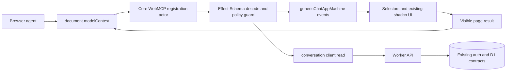
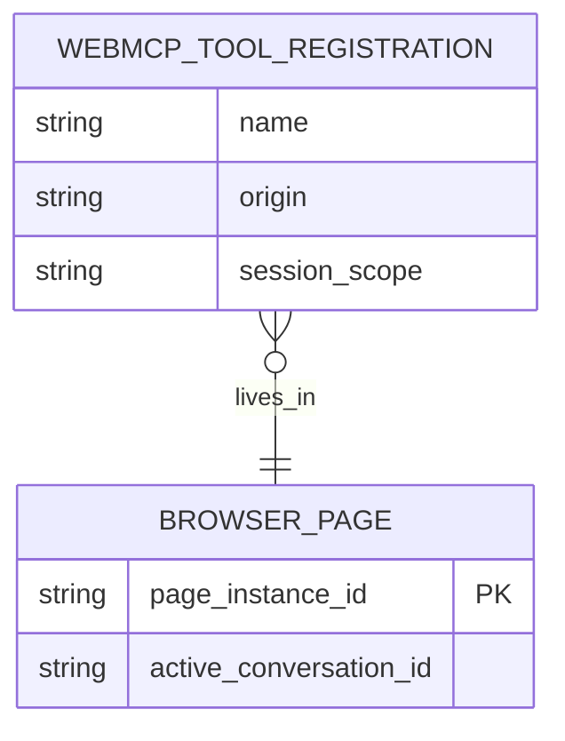

# WebMCP generic chat plan

## Context

- `apps/generic-web` is the canonical provider-agnostic chat fixture. Its React layer is a view:
  XState actors own session, transport, conversation, settings, browser, and UI state; React
  reads selectors and sends typed events.
- `@emi/core/runtime` and `@emi/core/components` contain the headless runtime and
  `@emi/core/components/styled` contains the shared
  shadcn-style surfaces used by both the main chat app and the generic fixture.
- The generic Worker exposes authenticated and anonymous conversation, memory, thread, and
  streaming-chat routes. WebMCP must call those existing contracts through the actor/client
  boundary rather than creating a second application protocol.
- WebMCP is an experimental proposed Web standard. Chrome documents imperative registration via
  `document.modelContext`, `registerTool({ name, description, inputSchema, execute }, { signal })`,
  tool annotations, and declarative HTML form annotations. The API requires an open browser
  context; cross-origin embedding also requires the `tools` Permissions Policy. The adapter stays
  behind feature detection because the browser proposal is still changing and Chrome's current
  documentation deprecates `navigator.modelContext` in favor of `document.modelContext`. See the
  [WebMCP overview](https://developer.chrome.com/docs/ai/webmcp),
  [imperative API](https://developer.chrome.com/docs/ai/webmcp/imperative-api), and
  [declarative API](https://developer.chrome.com/docs/ai/webmcp/declarative-api).

## Goal

Expose a small, safe set of structured chat-page tools to browser agents while keeping WebMCP an
optional progressive enhancement and preserving actor ownership of all application state.

The first release should make navigation, search, settings, and read-only memory inspection more
reliable for an agent. It should not turn a browser agent into an invisible API client or allow
unreviewed provider spend, data deletion, or credential access.

## What

Add an optional WebMCP adapter in reusable core web code. When the browser exposes
`document.modelContext`, the runtime creates one runtime-owned XState registration actor that
registers an allowlisted tool set. Tool inputs are decoded at the boundary, converted into existing
runtime actions, and returned as structured results. When the API is absent, the app behaves exactly
as it does today.

Initial tool set:

- `get_chat_context`: read the active conversation id, title, status, and visible capability flags.
- `search_conversations`: search the current user's conversations through the existing store/client.
- `open_conversation`: navigate to an existing conversation after validating its id and access.
- `start_new_chat`: create/select a new conversation through the existing actor flow.
- `set_theme`: select an existing light or dark theme setting.
- `search_memories`: perform read-only memory search in the current session scope.
- `fill_message_composer`: place text into the visible composer draft without sending it.

Every tool has a stable name, concise description, explicit JSON input schema, runtime decoding,
WebMCP policy annotations, and a result shape that excludes secrets and message content. The first
phase has no send, destructive, credential, arbitrary-fetch, or memory-mutation tool.

## Why

Browser agents currently have to infer chat controls from visual layout, labels, and timing. The
generic app already has stable actor events and accessible controls; WebMCP can expose those
intentions directly without coupling the Worker to an agent-specific server API. This should also
give the main app and future generated apps one reusable integration point.

WebMCP is still changing, so the integration must be easy to disable, easy to test without Chrome
support, and isolated from core chat behavior until the browser API stabilizes.

## How

### Conceptual model

WebMCP is a browser-page capability registry, not a replacement for the Worker API or an MCP
server. The page remains the visible authority: an agent invokes a declared tool, the tool routes
through the same actor/client path as a human interaction, and the resulting state is rendered by
the existing UI.

### Operations / behavior

1. Detect the optional `document.modelContext` capability at actor startup.
2. Register only the allowlisted tools for the current product configuration and session state.
3. Decode every input before sending an actor event or making a client request.
4. Scope reads and writes to the current anonymous/authenticated session; never accept a user id,
   cookie, API key, provider secret, or arbitrary URL as a tool input.
5. Return structured success or typed failure results. Do not expose raw exception text, HTML, or
   provider credentials.
6. Make navigation and draft filling visible through the normal UI. A future send tool must first
   use the visible composer and an explicit confirmation; it must not auto-submit in phase one.
7. Unregister tools with an `AbortController` when the page actor stops or the product context
   changes.

### Tech choices

| Choice                                              | Decision                                                                                        | Rationale                                                                                                                                                                |
| --------------------------------------------------- | ----------------------------------------------------------------------------------------------- | ------------------------------------------------------------------------------------------------------------------------------------------------------------------------ |
| WebMCP vs a custom MCP HTTP endpoint                | WebMCP as an optional page adapter                                                              | The useful context is the currently open conversation and visible UI; no new backend protocol is needed.                                                                 |
| Imperative vs declarative registration              | Imperative API for actor-owned tools; declarative forms only for future low-risk composer flows | Imperative registration maps to typed actor events and session-scoped reads. Declarative forms remain a useful progressive enhancement for visible form filling.         |
| `navigator.modelContext` vs `document.modelContext` | Use feature-detected `document.modelContext`                                                    | Current Chrome documentation says `navigator.modelContext` is obsolete in Chrome 150. Keep the browser surface behind one adapter so a proposal change affects one file. |
| Core vs app-specific registration                   | Core owns the adapter and schemas; each app supplies capabilities/configuration                 | Generic chat and generated apps share behavior without importing HealthFit product code into core. The main app can opt in later through the same runtime option.        |
| React state vs actors                               | Actor-owned registration lifecycle and event routing                                            | React remains a view and does not own chat, auth, persistence, or network state.                                                                                         |
| Runtime validation                                  | Effect Schema decoders paired with explicit WebMCP JSON schemas                                 | Inputs are checked at the browser boundary and again at the domain boundary; schema drift is testable.                                                                   |

### Architecture

The registration actor receives an injected browser capability and the runtime facade. Its public
adapter exposes only the read-only `WebMcpState` projection; it does not copy parent snapshots into
a second state tree. For reads that need current data, it reads the runtime's current actor-owned
state; for UI actions, it sends existing typed commands to the owning child actor. The runtime
retains the registration actor alongside the chat actor graph and aborts the registration signal
during shutdown.

## What this allows

- Agents can discover stable, structured actions on the open generic chat page; the main chat app
  can opt in later through the documented runtime boundary.
- Agents can search and open conversations, start a chat, set the theme, inspect memories, and
  prepare a visible draft with less brittle click inference.
- Existing auth, anonymous-session, persistence, and authorization rules remain the source of
  truth.
- The same registration contract can be enabled by generated apps without copying HealthFit
  feature code; `apps/generic-web` is the first enabled consumer.
- Chrome's WebMCP Inspector and browser automation can inspect schemas and visible tool results
  during development.

## What this does not allow

- No server-side, headless, or offline WebMCP execution; the browser page must be open and visible.
- No exposure of API keys, provider URLs with credentials, session cookies, internal database ids
  beyond the minimum conversation identifiers, or arbitrary backend fetches.
- No automatic send, provider invocation, archive/delete, memory deletion, file upload, or other
  irreversible/costly action in the first phase.
- No replacement for normal buttons, keyboard access, Playwright E2E, or the Worker API. The
  repository currently uses a deterministic Playwright harness rather than a separate generic
  Gherkin runner.
- No HealthFit/Hevy/sport-specific tools in the generic core adapter.

## UI & UX

### Desktop

The normal chat layout stays unchanged when WebMCP is unavailable. When an agent activates a tool,
the existing sidebar, conversation header, or composer receives the same selected-state styling as
a human interaction. Phase one does not add a separate WebMCP status banner; the structured tool
result and the existing visible state are the user-facing evidence of the action.

### Mobile

Tool-driven navigation opens the existing accessible sidebar drawer before selecting a conversation.
The composer remains visible after draft filling. Future confirmation actions must use the existing
mobile-safe dialog surface and never depend on hover-only controls; phase one exposes no such action.

### Common interactions

| Action                             | Result                                                                                                                             |
| ---------------------------------- | ---------------------------------------------------------------------------------------------------------------------------------- |
| Agent searches conversations       | Existing search actor/client updates the sidebar; structured results identify matching ids and titles.                             |
| Agent opens a conversation         | Existing route/store flow loads it and the header announces the selected conversation.                                             |
| Agent starts a new chat            | Existing new-chat event creates/selects the conversation; no provider request is made.                                             |
| Agent fills the composer           | Text appears in the visible draft and remains unsent until the user presses Send.                                                  |
| Agent requests a restricted action | No restricted tool is registered in phase one; a future tool must return a typed confirmation-required result before any mutation. |
| Browser lacks WebMCP               | No registration error is shown; ordinary human UI and tests continue unchanged.                                                    |

## Data model

No new persisted tables or migrations are planned for phase one. Tool registration and in-flight
results are ephemeral page state owned by the runtime's WebMCP actor. Existing conversation, memory, auth,
and event tables remain the only persistence source.

The diagram describes runtime ownership only; `BROWSER_PAGE` and `WEBMCP_TOOL_REGISTRATION` are
not database tables.

## Implementation steps

1. **[x]** Define the `WebMcpTool` contract, allowlist, policy annotations, Effect decoders, and
   JSON schemas in `packages/core/src/web/webmcp.ts` and
   `packages/core/src/web/chat-runtime/webmcp-actor.ts`. The public detection class is exported
   from `@emi/core/web`; the actor and schemas remain internal.
2. **[x]** Add the injected `ModelContext` capability and runtime-owned XState actor. Registration
   remains alive after success and aborts through one signal when the runtime stops.
3. **[x]** Route context, search, open, new chat, theme, memory search, and composer filling through
   the existing runtime facade and actor-owned state. No second network or React state path was
   introduced.
4. **[x]** Wire `apps/generic-web` through `ChatRuntimeOptions.webmcp` with
   `WebMcp.detect(document)`. `apps/chat` is not enabled yet; it can opt in through the same
   option after its separate runtime composition is migrated.
5. **[x]** Add core actor tests for feature gating, malformed input, redaction, stale identifiers,
   stateful actions, missing capability, and registration cleanup. Session scope is structural:
   tools accept no user id or credential and only dispatch through the injected authenticated
   runtime/client.
6. **[x]** Add a deterministic Playwright `document.modelContext` harness and generic browser
   coverage for discovery, context redaction, theme, memory search, and visible draft filling.
   Existing generic tests continue to run without WebMCP; a manual browser checklist remains.
7. **[x]** Add explicit `tools` Permissions Policy and origin-isolation headers/checks to the
   Worker, local Vite servers, and deployment documentation. Cross-origin iframe support remains
   out of phase one.
8. **[ ]** Revisit declarative annotations for the composer after imperative behavior is stable and
   the Chrome proposal has not introduced an incompatible form contract.
9. **[x]** Gate consumer opt-in with `VITE_WEBMCP_ENABLED`; keep `apps/chat` on a thin
   `createWebMcpRegistration` adapter with an explicit `toolNames` allowlist until its existing
   query actors expose typed WebMCP commands/subscriptions.

## Open questions

1. Staging owns the exact-origin Origin Trial token and response-header lifecycle; production stays
   disabled until the staging checklist passes. Local testing uses Chrome's WebMCP testing flag.
2. Should a future `send_message` tool stop at draft filling forever, or may it submit after a
   user-confirmed dialog? What provider-cost limit should gate it?
3. Should memory creation ever be agent-callable, or remain human-only because memories persist
   beyond the current conversation?
4. Does the main app need a separate capability allowlist for HealthFit tools, or should product
   tools compose into the same core registry with explicit policy metadata?
5. Which additional response fields are useful to an agent while still minimizing exposure of
   internal conversation identifiers and message content? The current contract returns minimal
   conversation ids/titles, memory summary/source fields, connection state, and capability flags.

## Acceptance criteria

- [x] The generic app and focused core/browser checks pass when WebMCP is absent; the full release
      check remains the final handoff gate.
- [x] With a test `document.modelContext` harness, only the allowlisted tools register and every
      registration has a valid name, description, JSON input schema, and policy metadata.
- [x] Tool inputs are runtime-decoded and malformed/missing-capability/stale-id requests return
      typed failures without uncaught exceptions or raw HTML. Cross-session scope is enforced by
      the injected runtime/client boundary; no tool accepts a user id or credential input.
- [x] Search, open, new-chat, theme, memory-search, and draft-fill actions route through existing
      runtime actions and actor-owned state; React adds no domain or network state.
- [x] Draft filling is visible and never sends a provider request. No restricted action is exposed
      in phase one, so confirmation-required execution is intentionally deferred.
- [x] Tool results tested so far exclude API keys and message content; provider failures are mapped
      to safe structured errors.
- [x] Generic source and generated-source boundary tests contain no HealthFit, Hevy, `apps/api`,
      or `apps/chat` imports.
- [ ] A manual Chrome/staging checklist verifies discovery, visible execution, origin isolation, and
      the `tools` Permissions Policy before enabling the feature by default. See
      `docs/webmcp-r1.md`; the current desktop session could not connect to Chrome.

## Decisions log

| Date       | Decision                                                                                  | Rationale                                                                                                                                                   |
| ---------- | ----------------------------------------------------------------------------------------- | ----------------------------------------------------------------------------------------------------------------------------------------------------------- |
| 2026-08-01 | Treat WebMCP as progressive enhancement behind feature detection                          | The proposal and Chrome implementation are experimental and the app must remain fully usable without them.                                                  |
| 2026-08-01 | Start with read/navigation/settings/draft tools                                           | These provide useful agent assistance without provider cost, destructive mutations, file privacy, or credential exposure.                                   |
| 2026-08-01 | Register through an XState child actor and existing adapters                              | This preserves the React-as-view architecture and avoids a second source of chat or session state.                                                          |
| 2026-08-01 | Use `document.modelContext` behind one compatibility adapter                              | Current Chrome documentation marks `navigator.modelContext` obsolete in Chrome 150, so browser API churn stays isolated.                                    |
| 2026-08-03 | Keep WebMCP registration in a runtime-owned actor and pass one abort signal to every tool | Registration cleanup is a lifecycle concern; leaving the callback active after success prevents XState state-exit cleanup from unregistering healthy tools. |
| 2026-08-03 | Export `WebMcp` from `@emi/core/web` and keep `ChatRuntimeOptions.webmcp` optional        | Consumers can discover the capability without a browser-global import or a new Worker dependency.                                                           |
| 2026-08-03 | Use light/dark only in phase one                                                          | Those are the existing generic runtime settings; system-theme negotiation can be added without changing tool names later.                                   |
