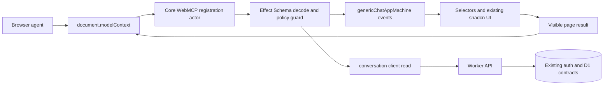
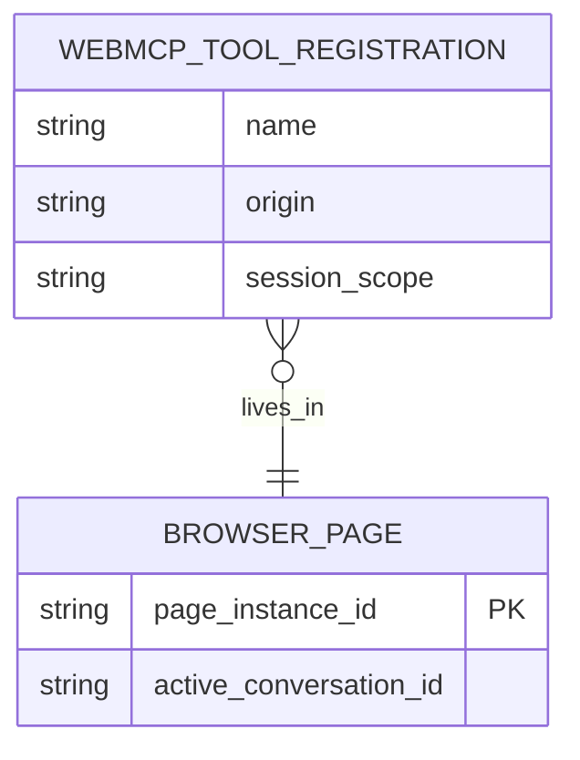

# WebMCP generic chat plan

## Context

- `apps/generic-web` is the canonical provider-agnostic chat fixture. Its React layer is a view:
  XState actors own session, transport, conversation, settings, browser, and UI state; React
  reads selectors and sends typed events.
- `@emi/core/web` contains the headless runtime and `@emi/core/web/styled` contains the shared
  shadcn-style surfaces used by both the main chat app and the generic fixture.
- The generic Worker exposes authenticated and anonymous conversation, memory, thread, and
  streaming-chat routes. WebMCP must call those existing contracts through the actor/client
  boundary rather than creating a second application protocol.
- WebMCP is an experimental proposed Web standard. Chrome documents imperative registration via
  `document.modelContext` and declarative HTML form annotations, with JSON input schemas and
  visible page execution. The API requires an open browser context, origin isolation, and the
  `tools` Permissions Policy. Local development currently uses
  `chrome://flags/#enable-webmcp-testing`; Chrome documents an Origin Trial beginning with
  Chrome 149. See the [WebMCP overview](https://developer.chrome.com/docs/ai/webmcp?hl=fr),
  [imperative API](https://developer.chrome.com/docs/ai/webmcp/imperative-api?hl=fr), and
  [declarative API](https://developer.chrome.com/docs/ai/webmcp/declarative-api?hl=fr).

## Goal

Expose a small, safe set of structured chat-page tools to browser agents while keeping WebMCP an
optional progressive enhancement and preserving actor ownership of all application state.

The first release should make navigation, search, settings, and read-only memory inspection more
reliable for an agent. It should not turn a browser agent into an invisible API client or allow
unreviewed provider spend, data deletion, or credential access.

## What

Add an optional WebMCP adapter in reusable core web code. When the browser exposes
`document.modelContext`, a child actor registers an allowlisted tool set. Tool inputs are decoded
at the boundary, converted into existing actor events or conversation-client calls, and returned as
structured results. When the API is absent, the app behaves exactly as it does today.

Initial tool set:

- `get_chat_context`: read the active conversation id, title, status, and visible capability flags.
- `search_conversations`: search the current user's conversations through the existing store/client.
- `open_conversation`: navigate to an existing conversation after validating its id and access.
- `start_new_chat`: create/select a new conversation through the existing actor flow.
- `set_theme`: select an existing light, dark, or system theme setting.
- `search_memories`: perform read-only memory search in the current session scope.
- `fill_message_composer`: place text into the visible composer draft without sending it.

Every tool has a stable name, concise description, explicit JSON input schema, runtime decoding,
and a result shape that excludes secrets and untrusted HTML.

## Why

Browser agents currently have to infer chat controls from visual layout, labels, and timing. The
generic app already has stable actor events and accessible controls; WebMCP can expose those
intentions directly without coupling the Worker to an agent-specific server API. This should also
give the main app and future generated apps one reusable integration point.

WebMCP is still changing, so the integration must be easy to disable, easy to test without Chrome
support, and isolated from core chat behavior until the browser API stabilizes.

## How

### Conceptual model

WebMCP is a browser-page capability registry, not a replacement for the Worker API or an MCP
server. The page remains the visible authority: an agent invokes a declared tool, the tool routes
through the same actor/client path as a human interaction, and the resulting state is rendered by
the existing UI.

### Operations / behavior

1. Detect the optional `document.modelContext` capability at actor startup.
2. Register only the allowlisted tools for the current product configuration and session state.
3. Decode every input before sending an actor event or making a client request.
4. Scope reads and writes to the current anonymous/authenticated session; never accept a user id,
   cookie, API key, provider secret, or arbitrary URL as a tool input.
5. Return structured success or typed failure results. Do not expose raw exception text, HTML, or
   provider credentials.
6. Make navigation and draft filling visible through the normal UI. A future send tool must first
   use the visible composer and an explicit confirmation; it must not auto-submit in phase one.
7. Unregister tools with an `AbortController` when the page actor stops or the product context
   changes.

### Tech choices

| Choice | Decision | Rationale |
|--------|----------|-----------|
| WebMCP vs a custom MCP HTTP endpoint | WebMCP as an optional page adapter | The useful context is the currently open conversation and visible UI; no new backend protocol is needed. |
| Imperative vs declarative registration | Imperative API for actor-owned tools; declarative forms only for future low-risk composer flows | Imperative registration maps to typed actor events and session-scoped reads. Declarative forms remain a useful progressive enhancement for visible form filling. |
| `navigator.modelContext` vs `document.modelContext` | Use feature-detected `document.modelContext` | Current Chrome documentation says `navigator.modelContext` is obsolete in Chrome 150. Keep the browser surface behind one adapter so a proposal change affects one file. |
| Core vs app-specific registration | Core owns the adapter and schemas; each app supplies capabilities/configuration | Main chat, generic chat, and generated apps share behavior without importing HealthFit product code into core. |
| React state vs actors | Actor-owned registration lifecycle and event routing | React remains a view and does not own chat, auth, persistence, or network state. |
| Runtime validation | Effect Schema decoders paired with explicit WebMCP JSON schemas | Inputs are checked at the browser boundary and again at the domain boundary; schema drift is testable. |

### Architecture

The registration actor receives injected browser capability and app adapters. It does not copy
parent snapshots into a second state tree. For reads that need current data, it asks the existing
conversation or memory client; for UI actions, it sends the existing typed event to the owning
child actor. The parent continues to retain only actor references and injected adapters.

## What this allows

- Agents can discover stable, structured actions on an open generic or main chat page.
- Agents can search and open conversations, start a chat, set the theme, inspect memories, and
  prepare a visible draft with less brittle click inference.
- Existing auth, anonymous-session, persistence, and authorization rules remain the source of
  truth.
- The same registration contract can be enabled by generated apps without copying HealthFit
  feature code.
- Chrome's WebMCP Inspector and browser automation can inspect schemas and visible tool results
  during development.

## What this does not allow

- No server-side, headless, or offline WebMCP execution; the browser page must be open and visible.
- No exposure of API keys, provider URLs with credentials, session cookies, internal database ids
  beyond the minimum conversation identifiers, or arbitrary backend fetches.
- No automatic send, provider invocation, archive/delete, memory deletion, file upload, or other
  irreversible/costly action in the first phase.
- No replacement for normal buttons, keyboard access, Playwright E2E, Gherkin scenarios, or the
  Worker API.
- No HealthFit/Hevy/sport-specific tools in the generic core adapter.

## UI & UX

### Desktop

The normal chat layout stays unchanged when WebMCP is unavailable. When an agent activates a tool,
the existing sidebar, conversation header, or composer receives the same focus and selected-state
styling as a human interaction. A compact, dismissible status message identifies the action, its
result, and any confirmation still required.

### Mobile

Tool-driven navigation opens the existing accessible sidebar drawer before selecting a conversation.
The composer remains visible after draft filling. Confirmation actions use the existing mobile-safe
dialog surface and never depend on hover-only controls.

### Common interactions

| Action | Result |
|--------|--------|
| Agent searches conversations | Existing search actor/client updates the sidebar; structured results identify matching ids and titles. |
| Agent opens a conversation | Existing route/store flow loads it and the header announces the selected conversation. |
| Agent starts a new chat | Existing new-chat event creates/selects the conversation; no provider request is made. |
| Agent fills the composer | Text appears in the visible draft and remains unsent until the user presses Send. |
| Agent requests a restricted action | Tool returns a typed confirmation-required result and the UI shows the existing confirmation surface. |
| Browser lacks WebMCP | No registration error is shown; ordinary human UI and tests continue unchanged. |

## Data model

No new persisted tables or migrations are planned for phase one. Tool registration and in-flight
results are ephemeral page state owned by the WebMCP actor. Existing conversation, memory, auth,
and event tables remain the only persistence source.

The diagram describes runtime ownership only; `BROWSER_PAGE` and `WEBMCP_TOOL_REGISTRATION` are
not database tables.

## Implementation steps

1. Define a versioned `WebMcpTool` contract, allowlist, policy annotations, Effect decoders, and
   JSON schema fixtures in `packages/core/src/web/webmcp/`.
2. Add an injected `ModelContext` capability interface and an XState child actor that registers,
   unregisters, and routes tool execution without requiring WebMCP at import time.
3. Add generic app event/read adapters for context, search, open, new chat, theme, memories, and
   visible composer draft filling. Keep all domain and network ownership in existing actors and
   clients.
4. Wire the optional actor into `apps/generic-web` and `apps/chat` through configuration, with
   no HealthFit imports in the generic boundary and no WebMCP dependency in the Worker.
5. Add response redaction and confirmation policy tests, including anonymous-session scoping,
   malformed JSON, missing capability, stale conversation ids, and restricted actions.
6. Add a generic Playwright BDD feature that runs with a deterministic `document.modelContext` test
   harness. Cover discovery, search/open, new chat, theme, draft filling, absence fallback, and
   confirmation-required results. Add a manual Chrome-flag/Inspector checklist separately because
   normal Playwright Chromium may not expose the experimental API.
7. Add `tools` Permissions Policy and origin-isolation checks to deployment documentation only
   after confirming the target hosting headers. Do not make cross-origin iframe support a phase-one
   dependency.
8. Revisit declarative annotations for the composer after imperative behavior is stable and the
   Chrome proposal has not introduced an incompatible form contract.

## Open questions

1. Which exact Chrome/Origin Trial channels should enable WebMCP in staging, and who owns the token
   lifecycle?
2. Should a future `send_message` tool stop at draft filling forever, or may it submit after a
   user-confirmed dialog? What provider-cost limit should gate it?
3. Should memory creation ever be agent-callable, or remain human-only because memories persist
   beyond the current conversation?
4. Does the main app need a separate capability allowlist for HealthFit tools, or should product
   tools compose into the same core registry with explicit policy metadata?
5. Which response fields are useful to an agent while still minimizing exposure of internal
   conversation identifiers and message content?

## Acceptance criteria

- [ ] The app loads and all existing unit, API integration, Playwright, and Playwright BDD tests
      pass when WebMCP is absent.
- [ ] With a test `document.modelContext` harness, only the allowlisted tools register and every
      registration has a valid name, description, JSON input schema, and policy metadata.
- [ ] Tool inputs are runtime-decoded; malformed, unauthorized, stale, or cross-session requests
      return typed failures without uncaught exceptions or raw HTML.
- [ ] Search, open, new-chat, theme, memory-search, and draft-fill actions route through existing
      actors/clients; React adds no domain or network state.
- [ ] Draft filling is visible and never sends a provider request. Restricted actions produce a
      confirmation-required result and remain unsent until an explicit human confirmation.
- [ ] Tool results never contain API keys, cookies, authorization headers, credential-bearing URLs,
      or unredacted provider errors.
- [ ] Generic source and generated-source boundary tests contain no HealthFit, Hevy, `apps/api`,
      or `apps/chat` imports.
- [ ] A manual Chrome flag/Origin Trial checklist verifies discovery, visible execution, origin
      isolation, and the `tools` Permissions Policy before enabling the feature by default.

## Decisions log

| Date | Decision | Rationale |
|------|----------|-----------|
| 2026-08-01 | Treat WebMCP as progressive enhancement behind feature detection | The proposal and Chrome implementation are experimental and the app must remain fully usable without them. |
| 2026-08-01 | Start with read/navigation/settings/draft tools | These provide useful agent assistance without provider cost, destructive mutations, file privacy, or credential exposure. |
| 2026-08-01 | Register through an XState child actor and existing adapters | This preserves the React-as-view architecture and avoids a second source of chat or session state. |
| 2026-08-01 | Use `document.modelContext` behind one compatibility adapter | Current Chrome documentation marks `navigator.modelContext` obsolete in Chrome 150, so browser API churn stays isolated. |
